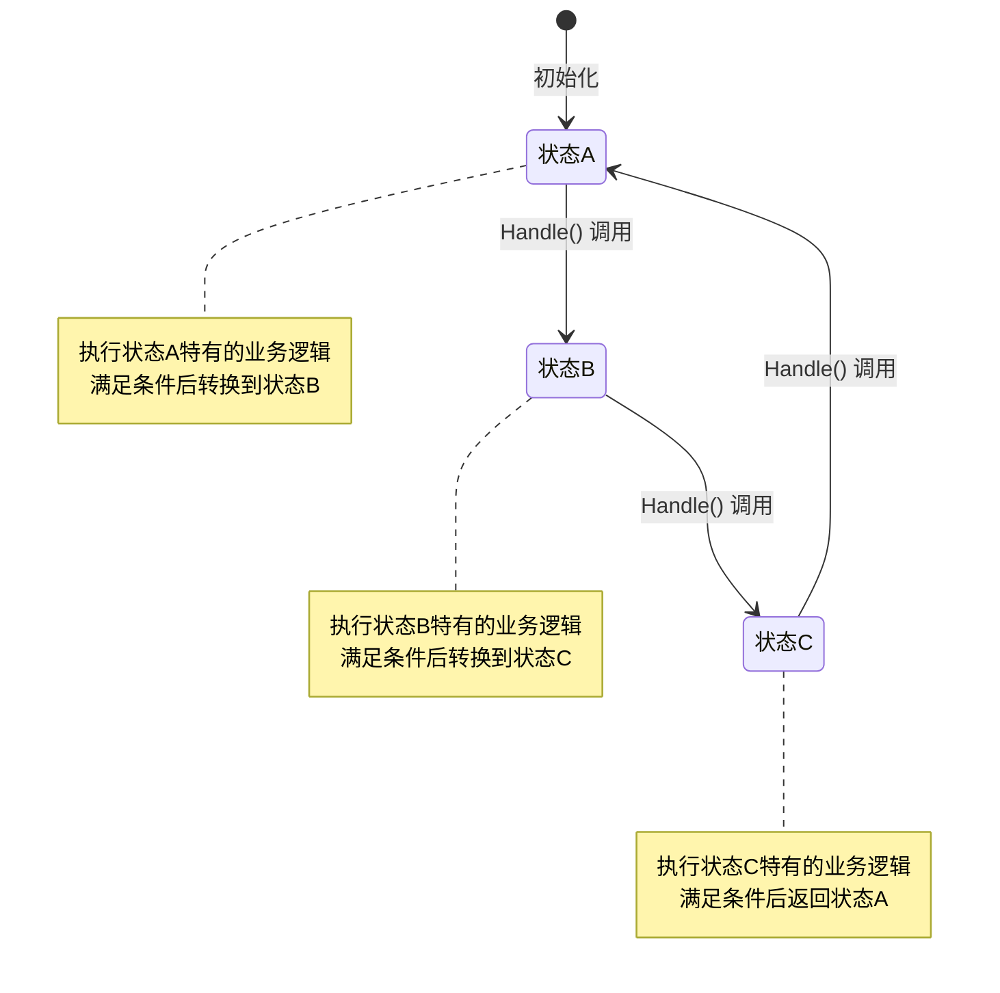
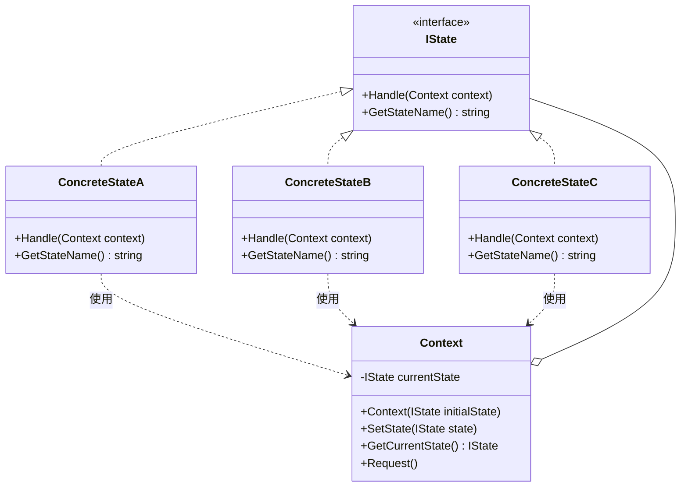
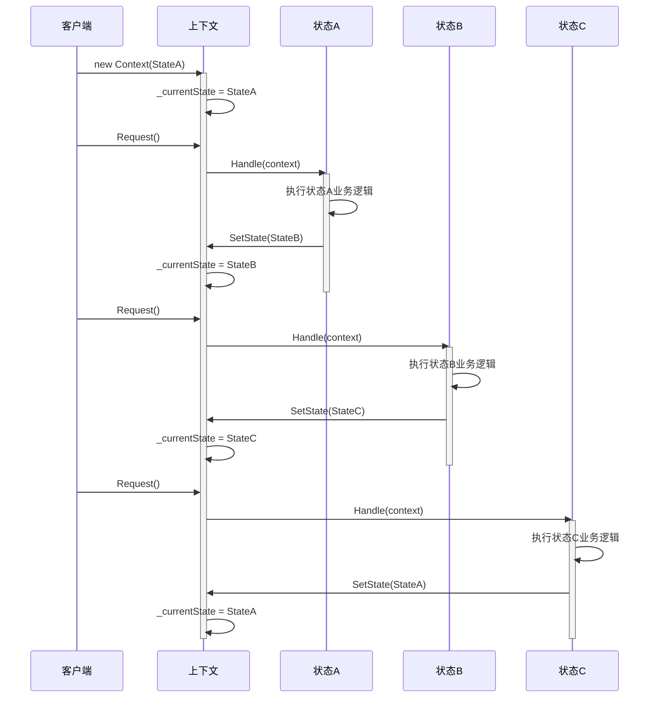

# 基础状态机模式 (State Pattern)

## 📋 目录
- [概述](#概述)
- [设计模式说明](#设计模式说明)
- [状态流转图](#状态流转图)
- [类图结构](#类图结构)
- [代码结构](#代码结构)
- [执行流程](#执行流程)
- [优缺点分析](#优缺点分析)
- [使用场景](#使用场景)
- [运行示例](#运行示例)

## 概述

状态模式（State Pattern）是一种行为型设计模式，它允许对象在内部状态改变时改变其行为，使对象看起来似乎修改了它的类。

### 核心思想
- 将状态相关的行为封装到独立的状态类中
- 通过改变上下文中的状态对象来改变行为
- 消除大量的条件分支语句（if-else/switch-case）

## 设计模式说明

### 模式组成

1. **IState (状态接口)**
   - 定义了所有具体状态必须实现的接口
   - 包含 `Handle()` 方法处理请求
   - 包含 `GetStateName()` 方法获取状态名称

2. **ConcreteStateA/B/C (具体状态类)**
   - 实现 IState 接口
   - 封装特定状态下的行为逻辑
   - 决定何时以及如何转换到其他状态

3. **Context (上下文类)**
   - 维护当前状态的引用
   - 提供状态切换的方法
   - 将客户端请求委托给当前状态对象

## 状态流转图



## 类图结构



## 代码结构

### 项目文件说明

| 文件名 | 说明 |
|--------|------|
| `IState.cs` | 状态接口定义 |
| `Context.cs` | 上下文类，维护当前状态 |
| `ConcreteStateA.cs` | 具体状态A实现 |
| `ConcreteStateB.cs` | 具体状态B实现 |
| `ConcreteStateC.cs` | 具体状态C实现 |
| `Program.cs` | 主程序入口，演示状态模式 |
| `StatePattern.csproj` | 项目配置文件 |

## 执行流程

### 时序图



### 详细流程说明

1. **初始化阶段**
   ```csharp
   var context = new Context(new ConcreteStateA());
   ```
   - 创建 Context 对象
   - 设置初始状态为 ConcreteStateA

2. **第一次请求**
   ```csharp
   context.Request();
   ```
   - Context 调用当前状态（StateA）的 Handle() 方法
   - StateA 执行自己的业务逻辑
   - StateA 调用 `context.SetState(new ConcreteStateB())`
   - 状态转换：StateA → StateB

3. **第二次请求**
   - Context 调用当前状态（StateB）的 Handle() 方法
   - StateB 执行自己的业务逻辑
   - StateB 调用 `context.SetState(new ConcreteStateC())`
   - 状态转换：StateB → StateC

4. **第三次请求**
   - Context 调用当前状态（StateC）的 Handle() 方法
   - StateC 执行自己的业务逻辑
   - StateC 调用 `context.SetState(new ConcreteStateA())`
   - 状态转换：StateC → StateA（循环）

## 优缺点分析

### ✅ 优点

1. **封装性好**
   - 将状态相关的行为局部化到单独的类中
   - 每个状态类只关注自己的行为

2. **易于扩展**
   - 新增状态只需添加新的状态类
   - 符合开闭原则（对扩展开放，对修改关闭）

3. **消除条件分支**
   - 避免大量的 if-else 或 switch-case 语句
   - 代码更清晰易读

4. **状态转换明确**
   - 状态转换逻辑集中在状态类中
   - 易于理解和维护

5. **单一职责原则**
   - 每个状态类只负责一个状态的行为
   - 职责清晰

### ❌ 缺点

1. **类数量增加**
   - 每个状态都需要一个类
   - 可能导致类数量爆炸

2. **状态转换分散**
   - 状态转换逻辑分散在各个状态类中
   - 可能难以全局把握状态转换流程

3. **增加系统复杂度**
   - 对于简单的状态转换可能过度设计
   - 增加了理解和维护成本

## 使用场景

### 适用情况

1. **对象行为依赖于其状态**
   - 对象需要根据不同状态改变行为
   - 状态转换规则复杂

2. **存在大量条件分支**
   - 代码中有大量 if-else 或 switch-case
   - 这些分支依赖于对象的状态

3. **状态转换规则复杂**
   - 多个状态之间有复杂的转换关系
   - 需要清晰地表达状态转换逻辑

### 实际应用示例

- **订单系统**: 待支付 → 已支付 → 已发货 → 已收货 → 已完成
- **文档系统**: 草稿 → 待审核 → 已发布 → 已归档
- **游戏角色**: 正常 → 受伤 → 虚弱 → 死亡
- **TCP连接**: 关闭 → 监听 → 连接 → 断开
- **电梯系统**: 停止 → 上升 → 下降 → 维护
- **自动售货机**: 等待投币 → 选择商品 → 出货 → 找零

## 运行示例

### 编译和运行

```bash
# 编译项目
dotnet build

# 运行程序
dotnet run
```

### 预期输出

```
========== 状态模式演示 ==========

初始状态: 状态A

========== 第 1 次请求 ==========

当前状态: 状态A
状态A正在处理请求...
执行状态A特有的业务逻辑
满足转换条件，切换到状态B
状态转换: 状态A -> 状态B

========== 第 2 次请求 ==========

当前状态: 状态B
状态B正在处理请求...
执行状态B特有的业务逻辑
满足转换条件，切换到状态C
状态转换: 状态B -> 状态C

========== 第 3 次请求 ==========

当前状态: 状态C
状态C正在处理请求...
执行状态C特有的业务逻辑
满足转换条件，切换回状态A
状态转换: 状态C -> 状态A

========== 第 4 次请求 ==========

当前状态: 状态A
状态A正在处理请求...
执行状态A特有的业务逻辑
满足转换条件，切换到状态B
状态转换: 状态A -> 状态B

========== 第 5 次请求 ==========

当前状态: 状态B
状态B正在处理请求...
执行状态B特有的业务逻辑
满足转换条件，切换到状态C
状态转换: 状态B -> 状态C

========== 演示结束 ==========
```

## C# 14 和 .NET 10 特性

本示例使用了以下现代 C# 特性：

- **Nullable 引用类型**: 提高代码安全性
- **隐式 using**: 简化代码
- **表达式主体成员**: 简洁的属性和方法定义
- **文档注释**: 完整的 XML 文档注释

## 总结

状态模式通过将状态相关的行为封装到独立的状态类中，使得对象可以在运行时改变其行为。这种模式特别适合处理具有复杂状态转换逻辑的场景，能够有效地消除条件分支语句，提高代码的可维护性和可扩展性。
