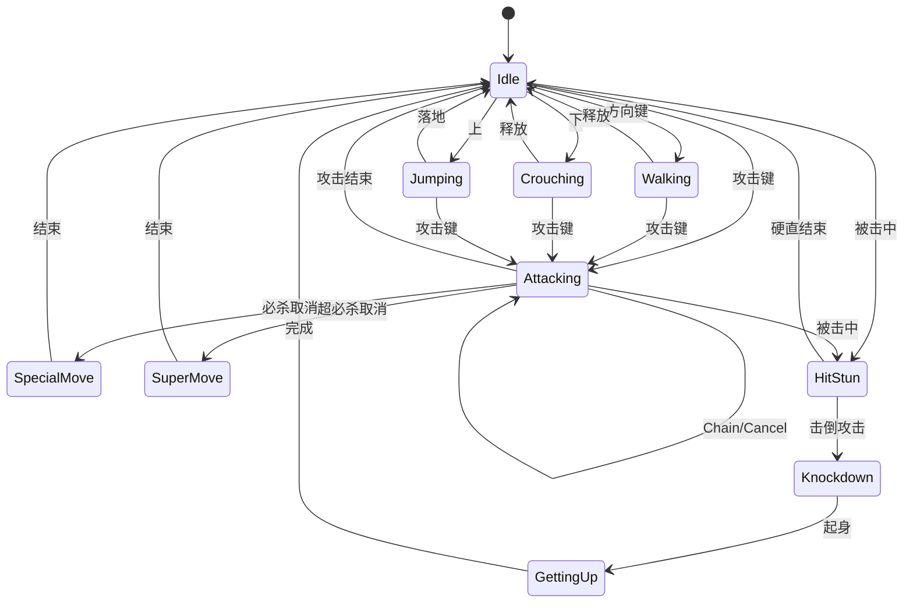
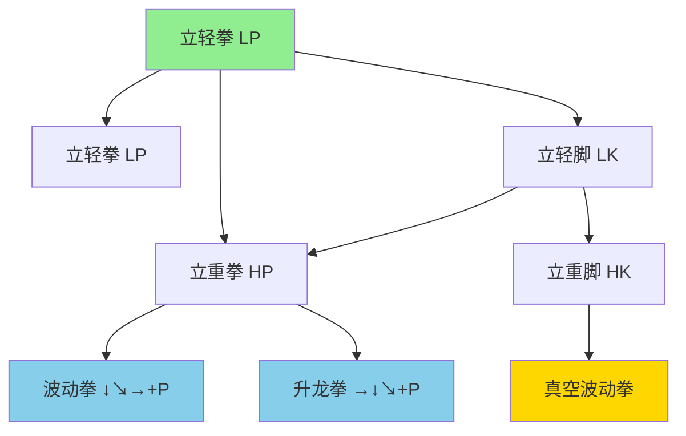
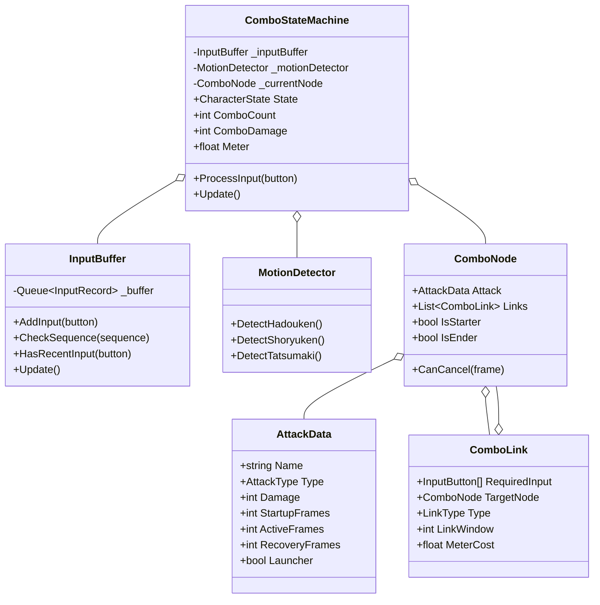

# 格斗连招系统 (Fighting Game Combo System)

## 📋 目录
- [概述](#概述)
- [核心机制](#核心机制)
- [状态流转图](#状态流转图)
- [帧数据系统](#帧数据系统)
- [类图结构](#类图结构)
- [运行示例](#运行示例)

## 概述

格斗连招系统实现了经典格斗游戏的核心机制，包含**输入缓冲**、**连招树**、**取消系统**、**帧数据**等专业格斗游戏特性。

## 核心机制

### 系统特性

| 特性 | 描述 |
|------|------|
| **输入缓冲** | 8帧输入缓冲，提高操作容错 |
| **指令检测** | ↓↘→、→↓↘等复杂指令识别 |
| **连招路径** | Chain、Link、Cancel三种链接 |
| **取消窗口** | 精确的帧数取消时机 |
| **伤害缩放** | 连段越长伤害越低 |
| **气量系统** | 攻击积攒，超必杀消耗 |

### 招式列表

| 招式 | 指令 | 伤害 | 帧数(前/判/后) |
|------|------|------|----------------|
| 立轻拳 | LP | 30 | 4/3/8 |
| 立轻脚 | LK | 35 | 5/3/10 |
| 立重拳 | HP | 80 | 8/4/18 |
| 立重脚 | HK | 100 | 12/5/22 |
| 波动拳 | ↓↘→+P | 70 | 12/10/30 |
| 升龙拳 | →↓↘+P | 120 | 3/12/35 |
| 旋风腿 | ↓↙←+K | 100 | 8/20/25 |
| 真空波动拳 | ↓↘→↓↘→+P | 300 | 8/25/40 |

## 状态流转图

### 角色状态机



### 连招树



## 帧数据系统

### 帧数据解释

```
招式帧数: 前摇 / 判定 / 后摇

┌─────────────────────────────────────────────────────┐
│ 按键  │← 前摇 →│← 判定 →│←    后摇    →│ 可行动  │
│       │ Startup │ Active │   Recovery   │         │
│  LP   │  4帧    │  3帧   │     8帧      │    ↓    │
└─────────────────────────────────────────────────────┘
          ↑                          ↑
        无敌/不能                  可以取消
        取消                     (取消窗口)
```

### 取消系统

```
┌────────────────────────────────────────────────────────────┐
│                     取消层级                                │
├────────────────────────────────────────────────────────────┤
│                                                            │
│   轻攻击 ─Chain→ 中攻击 ─Chain→ 重攻击                      │
│                                    │                       │
│                              ─Cancel→ 必杀技               │
│                                    │                       │
│                           ─Super Cancel→ 超必杀            │
│                                                            │
└────────────────────────────────────────────────────────────┘

Chain: 可在攻击中取消，时机宽松
Link: 需要等前一招完全结束，时机严格  
Cancel: 必杀技取消，需在判定帧期间
Super Cancel: 超必杀取消，需要气量
```

### 输入缓冲

```
时间轴 ─────────────────────────────────────────────────▶

帧   1   2   3   4   5   6   7   8   9   10  11  12
     │                       │           │
     └───────────────────────┘           │
              输入缓冲窗口(8帧)            │
                                         │
                              此时按键，读取缓冲中的输入
```

## 类图结构



## 运行示例

```bash
dotnet run
```

### 预期输出

```
╔════════════════════════════════════════════════════════════════╗
║              格斗连招系统演示 - 输入缓冲与连招树               ║
╚════════════════════════════════════════════════════════════════╝


========== 演示1: 基础连招 ==========
输入: LP → LP → LK → HP

  [输入] LP (帧: 1)

  ═══════════════════════════════════════════
  【立轻拳】 命中！
  伤害: 30 (缩放: 100%)
  帧数: 4/3/8
  连段: 1 Hits | 总伤害: 30
  气量: 5/100
  ═══════════════════════════════════════════

  [输入] LP (帧: 9)
  [连招] Chain → 立轻拳

  ═══════════════════════════════════════════
  【立轻拳】 命中！
  伤害: 27 (缩放: 90%)
  帧数: 4/3/8
  连段: 2 Hits | 总伤害: 57
  气量: 10/100
  ═══════════════════════════════════════════

  ...

  ★★★ 4 HIT COMBO! 总伤害: 217 ★★★


========== 演示2: 必杀技取消 ==========
输入: LP → HP → ↓↘→ + LP (波动拳取消)

  [输入] ↓ (帧: 55)
  [输入] ↓+→ (帧: 57)
  [输入] → (帧: 59)
  [输入] LP (帧: 61)
  🔥 必杀技: 波动拳!

  ═══════════════════════════════════════════
  【波动拳】 命中！
  伤害: 56 (缩放: 80%)
  帧数: 12/10/30
  连段: 3 Hits | 总伤害: 166
  气量: 30/100
  ═══════════════════════════════════════════
```

## 扩展建议

1. **添加更多角色**: 不同角色有不同的招式表
2. **命中判定**: 添加碰撞检测和受击反馈
3. **AI对手**: 实现电脑对手的连招AI
4. **训练模式**: 显示帧数和判定框
5. **在线对战**: 回滚网络代码(GGPO)
