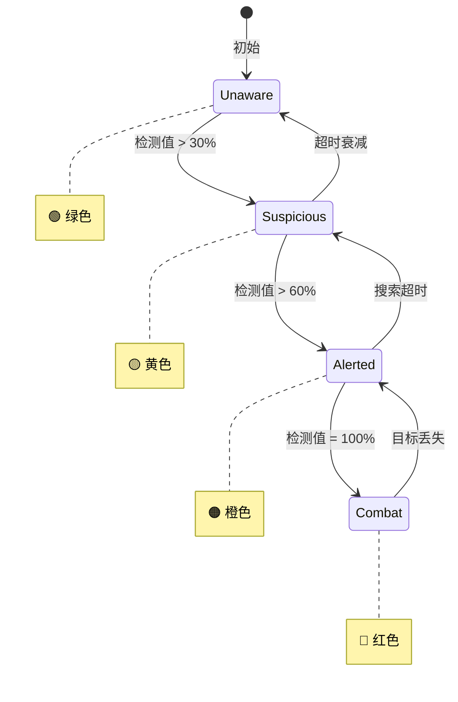
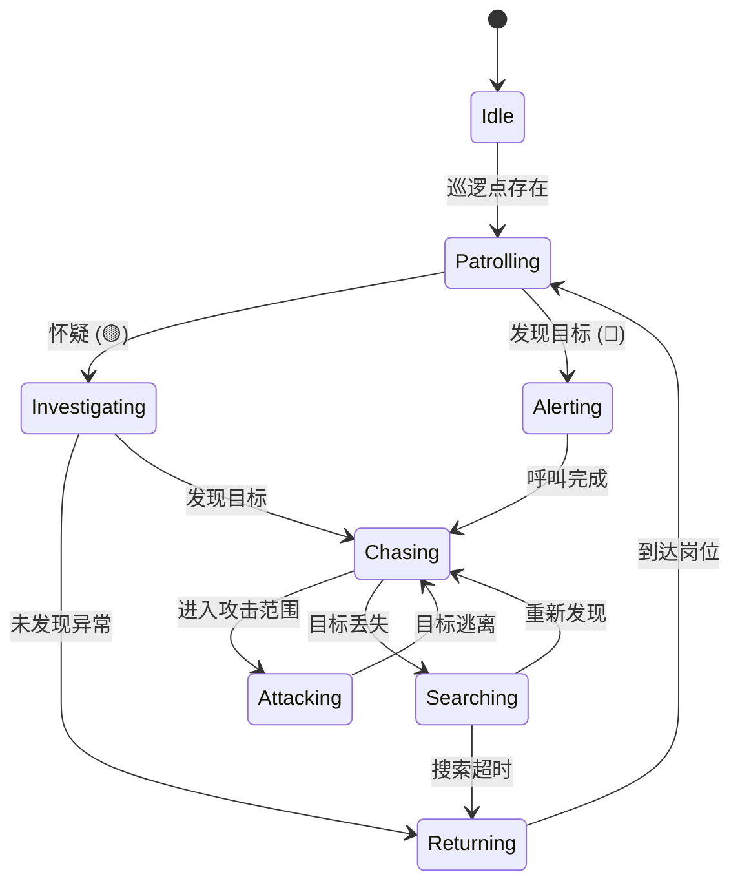
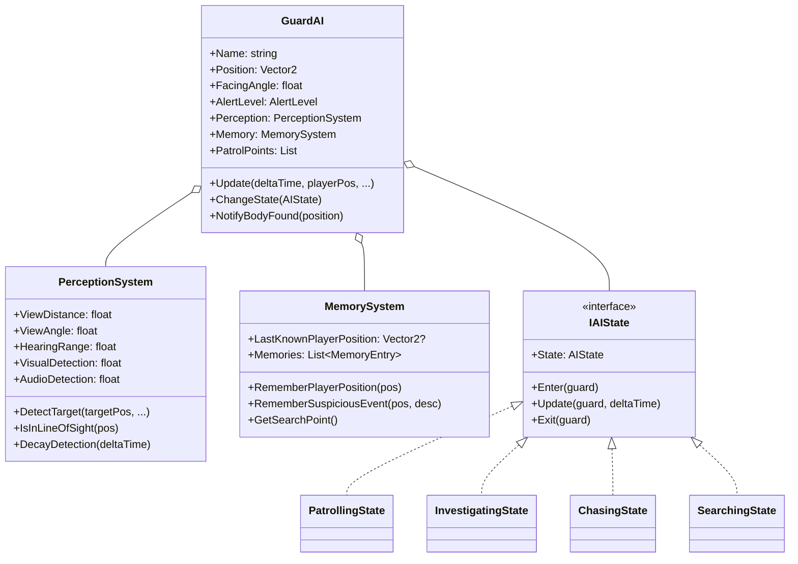

# 潜行AI系统 (Stealth AI System)

## 📋 目录
- [概述](#概述)
- [核心系统](#核心系统)
- [状态流转图](#状态流转图)
- [感知机制](#感知机制)
- [类图结构](#类图结构)
- [运行示例](#运行示例)

## 概述

潜行AI系统实现了经典潜行游戏（如《合金装备》、《刺客信条》）中的敌人AI行为，包含**视野锥检测**、**听觉感知**、**警戒等级**、**记忆系统**等机制。

## 核心系统

| 系统 | 描述 |
|------|------|
| **视觉感知** | 视野锥检测，余光区域，光照影响 |
| **听觉感知** | 声音检测，距离衰减 |
| **记忆系统** | 记住玩家位置，可疑事件 |
| **警戒等级** | 4级警戒，渐进式发现 |
| **行为状态** | 巡逻、调查、追击、搜索等 |

## 状态流转图

### 警戒等级



### AI行为状态



## 感知机制

### 视野锥

```
                    视野距离: 15m
                         │
      ┌──────────────────┼──────────────────┐
      │                  │                  │
      │    ╱─────────────┼─────────────╲    │
      │   ╱   余光区域   │   余光区域   ╲   │
      │  ╱  (150°, 30%) ┌┴┐ (150°, 30%)  ╲  │
      │ ╱              ╱   ╲              ╲ │
      │╱     ┌───────╱  👁️  ╲───────┐     ╲│
      │     ╱  正面视野 (90°, 100%)  ╲     │
      │    ╱                          ╲    │
      │   ╱                            ╲   │
      │  ▼                              ▼  │
      └────────────────────────────────────┘
                    守卫位置
```

### 检测修正

| 因素 | 视觉修正 | 听觉修正 |
|------|----------|----------|
| 移动中 | +50% | 基础 |
| 站立 | 基础 | 基础 |
| 蹲伏 | -50% | -70% |
| 光照下 | +30% | - |
| 近距离(<3m) | +100% | - |

### 警戒等级阈值

```
检测值  0%              30%             60%            100%
        │───────────────│───────────────│───────────────│
        │   🟢 Unaware  │ 🟡 Suspicious │  🟠 Alerted   │ 🔴 Combat
        │   (无察觉)    │   (有怀疑)    │   (已警觉)    │  (战斗)
        │               │               │               │
行为    │    巡逻       │   四处张望    │    调查       │  追击/攻击
```

## 类图结构



## 运行示例

```bash
dotnet run
```

### 预期输出

```
╔════════════════════════════════════════════════════════════════╗
║              潜行AI系统演示 - 视野检测与警戒                   ║
╚════════════════════════════════════════════════════════════════╝


========== 场景2: 玩家靠近（蹲行） ==========

玩家蹲着慢慢靠近...

  玩家位置: (46.0, 46.0), 检测值: 0%
  玩家位置: (36.0, 36.0), 检测值: 5%
  玩家位置: (26.0, 26.0), 检测值: 15%
  [守卫Alpha] ❓ 嗯？好像有什么...
  [警戒等级] 🟡 Suspicious


========== 场景3: 玩家暴露在光下 ==========

玩家站起来被灯光照到！

  [守卫Alpha] ⚠️ 警觉！检测到可疑目标！
  [警戒等级] 🟠 Alerted
  [状态变更] Patrolling → Investigating
  ⚠️ 守卫进入战斗状态！

┌────────────────────────────────────────────────────────┐
│ 👮 守卫Alpha        🔴 Combat                          │
│ 位置: (6.2, 4.1)         朝向: 45°                    │
│ 状态: Alerting                                         │
│ 检测: [████████████████████] 100%                     │
│   视觉: 85%  听觉: 15%                                 │
│ 记忆: 最后见于 (6.0, 6.0)                              │
└────────────────────────────────────────────────────────┘
```

## 扩展建议

1. **视线遮挡**: 添加射线检测，障碍物遮挡视线
2. **多守卫协作**: 共享警报和记忆
3. **巡逻路径**: A*寻路算法
4. **声音系统**: 区分脚步声、武器声、环境声
5. **玩家伪装**: 制服伪装检测
