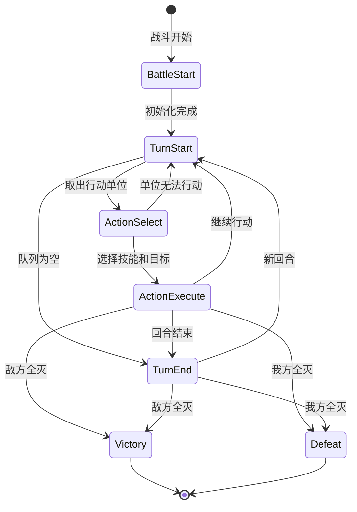

# 回合制战斗系统 (Turn-Based Battle System)

## 📋 目录
- [概述](#概述)
- [核心系统](#核心系统)
- [战斗流程图](#战斗流程图)
- [类图结构](#类图结构)
- [技能系统](#技能系统)
- [状态效果](#状态效果)
- [运行示例](#运行示例)

## 概述

经典JRPG风格的回合制战斗系统，实现了**行动队列**、**技能系统**、**元素克制**、**状态效果**等核心机制。类似《最终幻想》、《勇者斗恶龙》的战斗体验。

## 核心系统

| 系统 | 描述 |
|------|------|
| **行动队列** | 基于速度的回合顺序 |
| **技能系统** | 技能威力、消耗、冷却 |
| **元素系统** | 7种元素相互克制 |
| **状态效果** | Buff/Debuff，持续效果 |
| **伤害计算** | 攻防比、暴击、元素加成 |

## 战斗流程图

### 战斗阶段



### 行动顺序

```
回合开始
    │
    ▼
┌─────────────────────────────────────────────┐
│            计算行动顺序 (按速度排序)          │
│  夏恩(18) → 黑暗法师(14) → 梅林(12) → ...   │
└─────────────────────────────────────────────┘
    │
    ▼
┌─────────────────────────────────────────────┐
│                夏恩的回合                    │
│  1. 处理状态效果 (毒/烧/再生)                │
│  2. 检查能否行动 (眩晕/冰冻/麻痹?)          │
│  3. 选择技能和目标                          │
│  4. 执行技能                                │
└─────────────────────────────────────────────┘
    │
    ▼
    ... (其他单位依次行动)
    │
    ▼
回合结束
  - 状态效果持续时间 -1
  - 技能冷却 -1
  - 恢复 5 MP
```

## 类图结构

```mermaid
classDiagram
    class BattleSystem {
        +PlayerTeam: List~BattleUnit~
        +EnemyTeam: List~BattleUnit~
        +ActionQueue: ActionQueue
        +CurrentActor: BattleUnit
        +StartBattle()
        +ChangePhase(phase)
        +EndBattle(victory)
    }
    
    class ActionQueue {
        +CurrentRound: int
        +CurrentUnit: BattleUnit
        +Initialize(units)
        +StartNewRound()
        +GetNextUnit()
    }
    
    class BattleUnit {
        +Name: string
        +MaxHp, CurrentHp: int
        +MaxMp, CurrentMp: int
        +Attack, Defense, Speed: int
        +Element: Element
        +Skills: List~Skill~
        +StatusEffects: List~StatusEffect~
        +GetEffectiveAttack()
        +TakeDamage(damage)
        +Heal(amount)
        +AddStatusEffect(effect)
    }
    
    class Skill {
        +Name: string
        +ManaCost: int
        +Cooldown: int
        +BasePower: float
        +TargetType: TargetType
        +Element: Element
        +Effects: List
        +IsHealing: bool
    }
    
    class StatusEffect {
        +Type: StatusEffectType
        +Duration: int
        +Value: float
        +IsBuff: bool
        +PreventsAction: bool
    }
    
    class IBattleState {
        <<interface>>
        +Phase: BattlePhase
        +Enter(battle)
        +Update(battle)
        +Exit(battle)
    }
    
    BattleSystem o-- ActionQueue
    BattleSystem o-- BattleUnit
    BattleSystem o-- IBattleState
    BattleUnit o-- Skill
    BattleUnit o-- StatusEffect
```



## 技能系统

### 技能列表

| 技能 | 消耗 | 冷却 | 威力 | 目标 | 效果 |
|------|------|------|------|------|------|
| 普通攻击 | 0 | 0 | 1.0x | 单体 | - |
| 火球术 | 15 | 0 | 1.5x | 单体 | 30%燃烧 |
| 暴风雪 | 30 | 2 | 0.8x | 群体 | 20%冰冻,50%减速 |
| 雷击 | 20 | 1 | 1.8x | 单体 | 25%麻痹 |
| 治愈术 | 20 | 0 | 30%HP | 单体 | 治疗 |
| 群体治愈 | 40 | 2 | 20%HP | 群体 | 治疗 |
| 毒刃 | 10 | 0 | 1.2x | 单体 | 50%中毒 |
| 狂暴 | 20 | 4 | - | 自身 | +80%攻,-30%防 |
| 盾击 | 15 | 2 | 0.8x | 单体 | 40%眩晕 |
| 反击姿态 | 10 | 2 | - | 自身 | 反击2回合 |

### 伤害公式

```
基础伤害 = 攻击力 × 技能威力

防御减伤 = 防御力 / (防御力 + 100)
减伤后伤害 = 基础伤害 × (1 - 防御减伤)

暴击判定 (10%): 伤害 × 1.5
元素克制: 伤害 × 1.5
元素抵抗: 伤害 × 0.75

最终伤害 = 取整(以上计算) × 随机浮动(±10%)
```

## 状态效果

### Buff (增益)

| 效果 | 图标 | 描述 |
|------|------|------|
| 攻击提升 | ⚔️↑ | 增加攻击力 |
| 防御提升 | 🛡️↑ | 增加防御力 |
| 速度提升 | 💨↑ | 增加速度 |
| 再生 | 💚 | 每回合恢复HP |
| 护盾 | 🔰 | 吸收伤害 |
| 反击 | ↩️ | 受到攻击时反击 |

### Debuff (减益)

| 效果 | 图标 | 描述 |
|------|------|------|
| 攻击下降 | ⚔️↓ | 降低攻击力 |
| 防御下降 | 🛡️↓ | 降低防御力 |
| 速度下降 | 💨↓ | 降低速度 |
| 中毒 | ☠️ | 每回合损失HP |
| 燃烧 | 🔥 | 每回合损失HP |
| 冰冻 | ❄️ | 无法行动 |
| 麻痹 | ⚡ | 无法行动 |
| 沉默 | 🔇 | 无法使用技能 |
| 睡眠 | 💤 | 无法行动 |
| 眩晕 | 💫 | 无法行动 |

### 元素克制

```
        ┌───────────────┐
        │      火       │
        └───────┬───────┘
                │ 克制
        ┌───────▼───────┐
        │      风       │
        └───────┬───────┘
                │ 克制
        ┌───────▼───────┐
        │      土       │
        └───────┬───────┘
                │ 克制
        ┌───────▼───────┐
        │      雷       │
        └───────┬───────┘
                │ 克制
        ┌───────▼───────┐
        │      水       │──────┐
        └───────────────┘      │克制
                               │
        ┌───────────────┐      │
        │      火       │◄─────┘
        └───────────────┘
        
        ┌───────────────┐
        │      光       │◄────┐
        └───────┬───────┘     │
                │ 互相克制    │
        ┌───────▼───────┐     │
        │      暗       │─────┘
        └───────────────┘
```

## 运行示例

```bash
dotnet run
```

### 预期输出

```
╔════════════════════════════════════════════════════════════════╗
║                   🎲 回合制战斗系统演示 🎲                     ║
╚════════════════════════════════════════════════════════════════╝

╔══════════════════════════════════════════════════════════════╗
║                      ⚔️  战斗开始  ⚔️                        ║
╚══════════════════════════════════════════════════════════════╝

【我方队伍】
  👤 阿瑟         HP [███████████████] 150/150  MP [██████████]  40/40
  👤 梅林         HP [███████████████]  80/80   MP [██████████] 100/100
  👤 艾莉         HP [███████████████] 100/100  MP [██████████]  80/80
  👤 夏恩         HP [███████████████]  90/90   MP [██████████]  50/50

【敌方队伍】
  👹 哥布林A      HP [███████████████]  60/60   MP [██████████]  20/20
  👹 哥布林B      HP [███████████████]  60/60   MP [██████████]  20/20
  👹 兽人战士     HP [███████████████] 120/120  MP [██████████]  30/30
  👹 黑暗法师     HP [███████████████]  70/70   MP [██████████]  90/90

  ══════════ 第 1 回合 ══════════
  行动顺序: 夏恩 → 黑暗法师 → 梅林 → 哥布林A → 哥布林B → 艾莉 → 阿瑟 → 兽人战士

  ─── 夏恩 的回合 ───

    ▶ 夏恩 使用 【毒刃】
      消耗 10 MP
      ⚔️ 哥布林A 受到 32 伤害
    💠 哥布林A 获得效果: ☠️ 中毒 (3回合)

  ─── 黑暗法师 的回合 ───

    ▶ 黑暗法师 使用 【沉默】
      消耗 20 MP
      ⚔️ 梅林 受到 18 伤害
    💠 梅林 获得效果: 🔇 沉默 (2回合)

...
```

## 扩展建议

1. **UI系统**: 添加图形化战斗界面
2. **AI系统**: 更智能的敌人行为决策
3. **装备系统**: 武器、防具影响属性
4. **召唤技能**: 召唤物作为额外单位
5. **连携技**: 多角色联合攻击
6. **属性成长**: 经验值和升级系统
