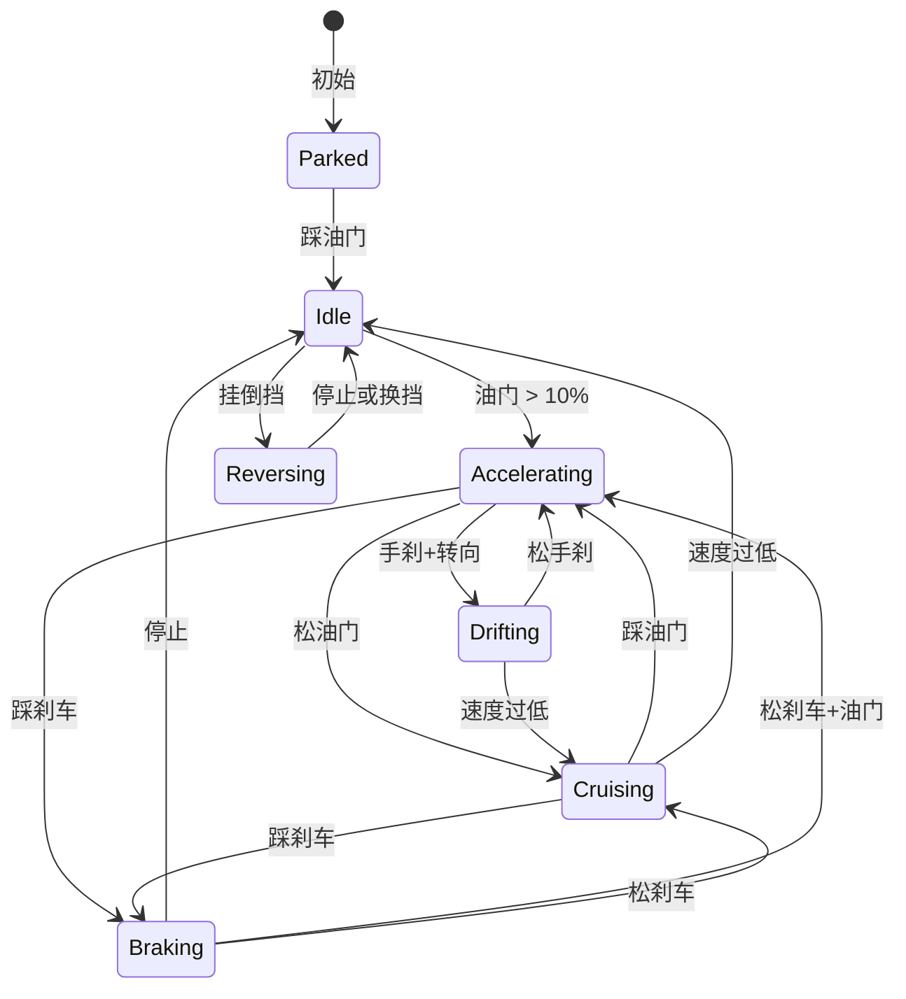
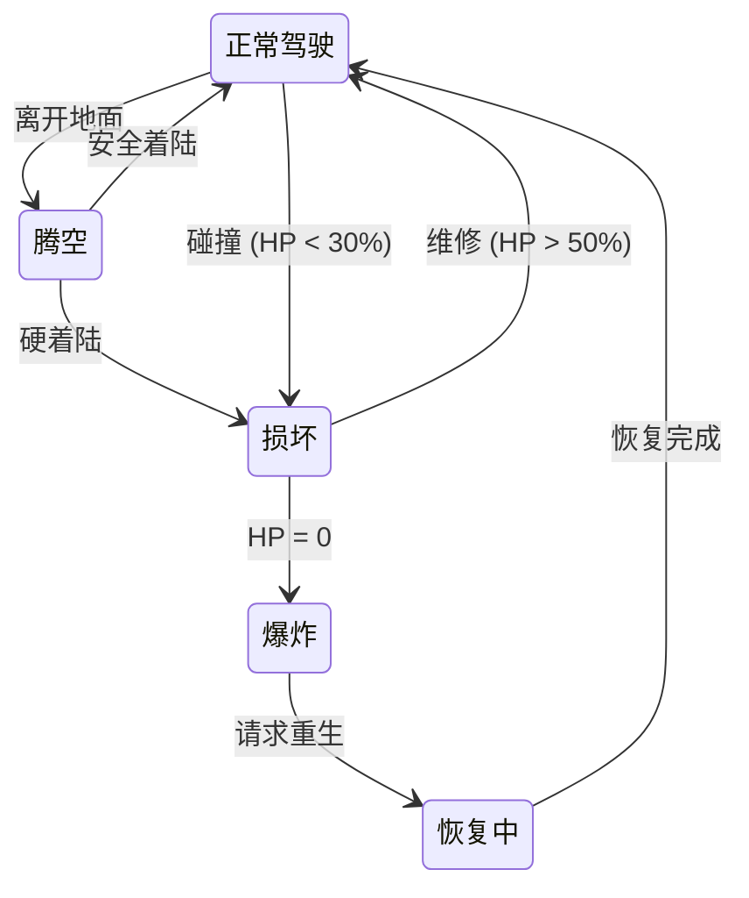
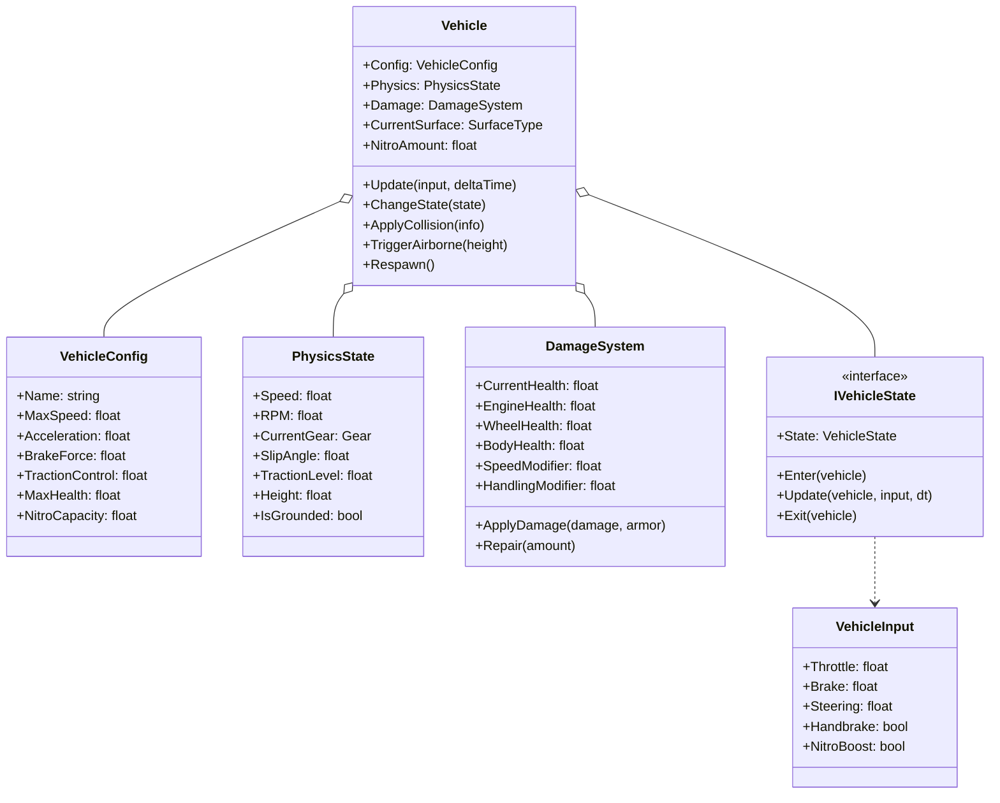

# 赛车载具系统 (Racing Vehicle System)

## 📋 目录
- [概述](#概述)
- [核心系统](#核心系统)
- [状态流转图](#状态流转图)
- [类图结构](#类图结构)
- [物理模拟](#物理模拟)
- [损坏系统](#损坏系统)
- [运行示例](#运行示例)

## 概述

赛车游戏载具系统，实现了**物理状态模拟**、**漂移系统**、**氮气加速**、**碰撞损坏**等机制。类似《极品飞车》、《地平线》的驾驶体验。

## 核心系统

| 系统 | 描述 |
|------|------|
| **物理模拟** | 速度、加速度、RPM、档位 |
| **漂移系统** | 手刹触发、滑移角、漂移分数 |
| **氮气加速** | 瞬间加速、消耗与恢复 |
| **损坏系统** | 碰撞伤害、部件损坏、性能下降 |
| **路面系统** | 不同路面影响抓地力 |

## 状态流转图

### 主要状态



### 特殊状态



## 类图结构



## 物理模拟

### 加速度计算

```
基础加速度 = 配置加速度 × 油门输入
             × 发动机效率 (受损时下降)
             × 路面抓地力
             × 氮气加成 (使用时 ×1.5-1.8)

速度变化 = 加速度 × 时间 × 3.6 (转换为km/h)
最终速度 = min(当前速度 + 速度变化, 最大速度 × 损坏修正)
```

### 路面抓地力

| 路面 | 抓地力 | 描述 |
|------|--------|------|
| 沥青 (Asphalt) | 100% | 最佳抓地力 |
| 混凝土 (Concrete) | 95% | 良好抓地力 |
| 泥土 (Dirt) | 70% | 中等抓地力 |
| 草地 (Grass) | 60% | 较低抓地力 |
| 沙地 (Sand) | 50% | 低抓地力 |
| 冰面 (Ice) | 20% | 极低抓地力 |
| 水面 (Water) | 40% | 减速 |

### 漂移系统

```
触发条件:
  - 手刹按下
  - 速度 > 30 km/h
  - 转向输入 > 50%

漂移中:
  - 滑移角 = 转向 × 45°
  - 速度损失较小 (2 km/h/s)
  - 轮胎磨损
  - 漂移分数累积

结束条件:
  - 松开手刹
  - 转向 < 30%
  - 速度 < 25 km/h
```

## 损坏系统

### 损坏计算

```
碰撞伤害 = 冲击力 × 0.5 / 护甲系数

部件损坏 (随机分配):
  发动机: 50-100% 伤害
  轮胎: 30-70% 伤害
  车身: 40-100% 伤害
```

### 性能影响

| 部件 | 损坏程度 | 影响 |
|------|----------|------|
| 发动机 < 30% | 严重 | 最高速 ×0.5 |
| 发动机 < 60% | 中等 | 最高速 ×0.7 |
| 发动机 < 80% | 轻微 | 最高速 ×0.9 |
| 轮胎 < 30% | 严重 | 操控 ×0.5 |
| 轮胎 < 60% | 中等 | 操控 ×0.75 |

### 损坏等级

```
         100%            70%             30%              0%
          │───────────────│───────────────│───────────────│
          │    正常       │   轻微损坏    │   严重损坏    │  爆炸
          │               │   (警告)      │   (性能下降)  │  💥
```

## 载具类型

| 类型 | 极速 | 加速 | 护甲 | 特点 |
|------|------|------|------|------|
| Sport GT | 280 | 10 | 0.8 | 平衡型 |
| Muscle V8 | 240 | 12 | 1.2 | 易漂移 |
| Offroad Beast | 160 | 6 | 1.5 | 高越野 |
| Hyper X | 350 | 14 | 0.6 | 极速型 |

## 运行示例

```bash
dotnet run
```

### 预期输出

```
╔════════════════════════════════════════════════════════════════╗
║                   🚗 赛车载具系统演示 🚗                       ║
╚════════════════════════════════════════════════════════════════╝


========== 场景1: 起步加速 ==========

  🅿️ 车辆已停放

┌─────────────────────────────────────────────────────────────┐
│  🚗 Muscle V8               🅿️ Parked                      │
├─────────────────────────────────────────────────────────────┤
│  速度  [░░░░░░░░░░░░░░░░░░░░]    0.0 km/h          │
│  转速  [░░░░░░░░░░░░░░░]    0 RPM  档位:  N  │
│  耐久  [██████████] 100%                    │
│  氮气  [██████████] 100%                    │
└─────────────────────────────────────────────────────────────┘

--- 踩油门启动 ---
  [状态] Parked → Idle
  🔑 启动引擎...
  ⚙️ 怠速中
  [状态] Idle → Accelerating
  🚀 加速中!

--- 全油门加速 ---
  速度: 52.3 km/h, 档位: Second
  速度: 97.6 km/h, 档位: Third
  速度: 136.2 km/h, 档位: Fourth

========== 场景3: 漂移 ==========

--- 拉手刹+转向，开始漂移! ---
  [状态] Braking → Drifting
  🌀 开始漂移!
  🌀 漂移中! 滑移角: 40.5°
  🌀 漂移中! 滑移角: 40.5°
  🏆 漂移得分: 2847


========== 场景5: 碰撞与损坏 ==========

--- 高速碰撞! ---
  💥 碰撞! 撞击 墙壁, 冲击力: 80
  [状态] Accelerating → Damaged
  ⚠️ 车辆严重损坏! 剩余耐久: 27%
```

## 扩展建议

1. **物理引擎集成**: 连接真实物理引擎
2. **多人竞速**: 网络同步状态
3. **天气系统**: 雨天、夜晚影响驾驶
4. **改装系统**: 升级部件影响性能
5. **AI对手**: 赛道AI驾驶行为
6. **赛道系统**: 检查点、排名、圈数
