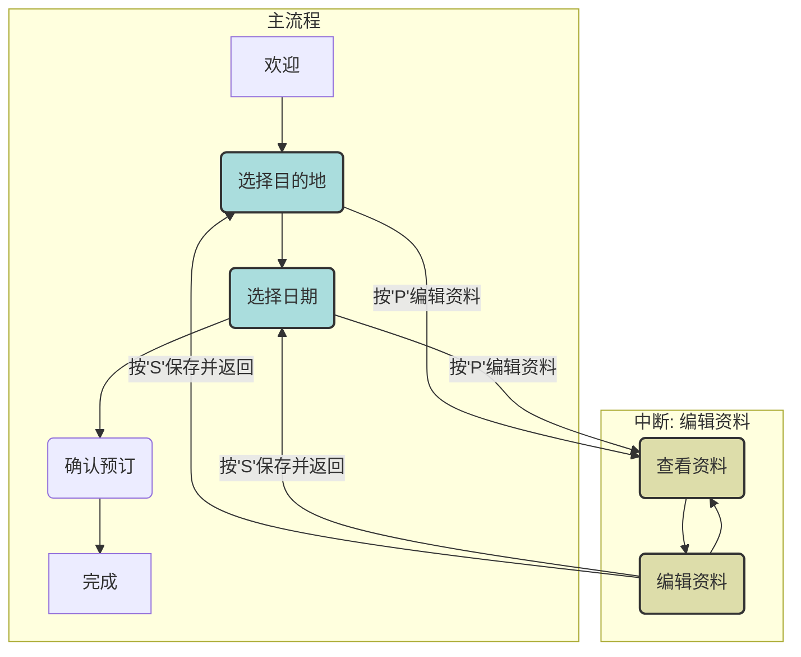
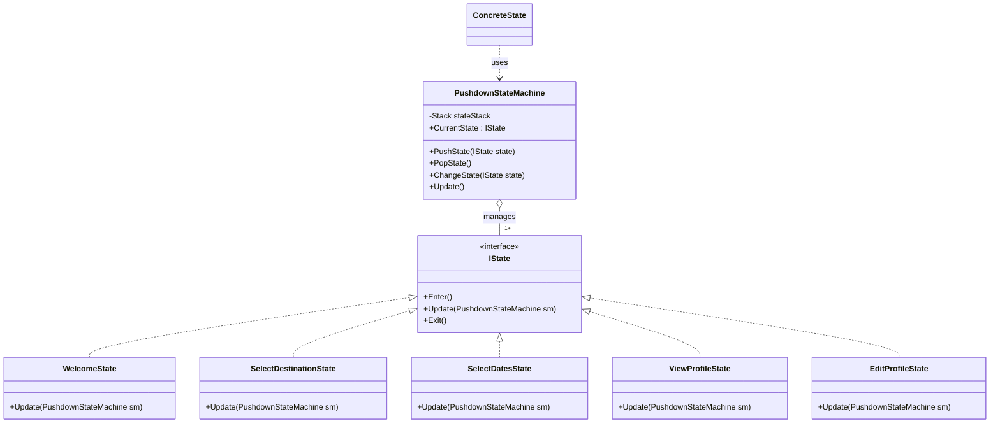

# 14. 栈驱动状态机 (Pushdown Automaton)

## 📋 目录
- [概述](#概述)
- [设计模式说明](#设计模式说明)
- [状态流转图](#状态流转图)
- [类图结构](#类图结构)
- [代码结构](#代码结构)
- [执行流程](#执行流程)
- [优缺点分析](#优缺点分析)
- [使用场景](#使用场景)
- [运行示例](#运行示例)

## 概述

栈驱动状态机（Pushdown Automaton）是普通状态机的一个扩展。它在核心状态管理机制中引入了一个**栈**结构，用于存储状态序列。

这种模式允许状态机“记住”它之前的状态，并在完成一个子流程后返回。这对于处理需要“深入”然后“返回”的复杂工作流（如函数调用、菜单导航或向导中断）非常有用。

### 核心思想
- **状态栈**: 使用一个栈来管理当前状态以及所有被“暂停”的父状态。当前状态始终是栈顶的元素。
- **Push (压栈)**: 当需要进入一个子流程或中断当前流程时，将新状态压入栈顶。当前状态变为新状态，旧状态被暂停。
- **Pop (弹栈)**: 当子流程完成时，将栈顶状态弹出。状态机恢复到上一个状态，从而“返回”到主流程。
- **Change (替换)**: 在同一层级内进行状态转换，即替换栈顶的状态（相当于传统的状态转换）。

## 设计模式说明

### 模式组成

1. **IState (状态接口)**
   - 定义状态行为的接口，通常包含 `Enter`, `Update`, `Exit` 等方法。
   - `Update` 方法负责处理当前状态的逻辑，并决定下一个动作（Push, Pop, Change）。

2. **ConcreteState (具体状态类)**
   - 实现 IState 接口。
   - 封装特定状态下的行为。
   - 调用状态机的 `PushState`, `PopState`, 或 `ChangeState` 方法来驱动转换。

3. **PushdownStateMachine (上下文类)**
   - 维护一个 `Stack<IState>` 状态栈。
   - 提供 `PushState`, `PopState`, 和 `ChangeState` 方法来操作状态栈。
   - 将外部请求（如 `Update()`）委托给栈顶的当前状态。

## 状态流转图

本示例将模拟一个旅行预订流程，其中用户可以在预订过程中随时中断去编辑个人资料。

### 场景描述
- **主流程**: 欢迎 -> 选择目的地 -> 选择日期 -> 确认 -> 完成
- **中断流程**: 在“选择目的地”或“选择日期”时，用户可以决定“编辑资料”。
- **恢复**: 编辑完资料后，系统应自动返回到之前的步骤。

### 流程图

- **Push 操作**: 从 `选择目的地` 或 `选择日期` 进入 `查看资料` 状态时发生。
- **Pop 操作**: 从 `编辑资料` 保存并返回时发生，将恢复到 `选择目的地` 或 `选择日期`。

## 类图结构



## 代码结构

| 文件名 | 说明 |
|---|---|
| `PushdownAutomaton.csproj` | 项目配置文件 |
| `README.md` | 本说明文件 |
| `IState.cs` | 状态接口定义 |
| `PushdownStateMachine.cs` | 栈驱动状态机核心实现 |
| `States.cs` | 包含所有具体状态类的实现 |
| `Program.cs` | 主程序入口，演示状态机流程 |

## 执行流程

1. **启动**: 状态机初始化，`WelcomeState` 被 Push 为初始状态。
2. **进入主流程**: `WelcomeState` 显示欢迎信息，然后 `ChangeState` 到 `SelectDestinationState`。
3. **在主流程中**:
   - `SelectDestinationState` 等待用户输入。
   - 如果输入目的地，则 `ChangeState` 到 `SelectDatesState`。
   - 如果用户按 'P'，则 `PushState` 到 `ViewProfileState`，`SelectDestinationState` 被暂停。
4. **进入子流程 (编辑资料)**:
   - `ViewProfileState` 显示资料，然后 `ChangeState` 到 `EditProfileState`。
   - `EditProfileState` 等待用户输入。
   - 如果用户按 'S' 保存，则调用 `PopState`。
5. **恢复主流程**:
   - `PopState` 弹出 `ViewProfileState` 和 `EditProfileState` 相关的状态。栈顶恢复为 `SelectDestinationState`。
   - 用户现在可以继续选择目的地。
6. **循环**: 整个过程可以重复，展示了状态的暂停和恢复能力。

## 优缺点分析

### ✅ 优点

1. **强大的流程控制**: 非常适合需要嵌套和中断的复杂工作流。
2. **上下文保留**: 暂停和恢复状态时，上下文（如已填写的数据）可以被自然保留。
3. **高内聚，低耦合**: 状态逻辑被封装在各自的类中，主流程和子流程可以独立开发和维护。
4. **可重用性**: 子流程（如“编辑资料”）可以从主流程的任何地方调用。
5. **清晰的导航历史**: 状态栈本身就是用户导航路径的记录。

### ❌ 缺点

1. **增加复杂性**: 对于简单的线性流程，引入栈是过度设计。
2. **状态管理开销**: 维护状态栈比维护单个状态变量需要更多的内存和管理逻辑。
3. **调试困难**: 状态栈的深度和变化可能使调试变得复杂，难以追踪当前状态的来源。
4. **状态泄露风险**: 如果 Pop 和 Push 操作不严格配对，可能导致状态“泄露”或流程错误。

## 使用场景

1. **UI 导航**: 应用程序中的菜单系统、向导（Wizards）和多步骤表单。例如，从设置页面进入一个子菜单，完成后再返回。
2. **游戏开发**:
   - 游戏状态管理（主菜单 -> 游戏中 -> 暂停菜单 -> 返回游戏）。
   - 角色AI，当一个常规行为（如巡逻）被特殊事件（如玩家出现）中断时。
3. **编译器和解释器**: 用于解析语法结构，特别是处理嵌套表达式和块。
4. **事务处理**: 对需要回滚到某个保存点的复杂事务进行建模。
5. **任何需要“返回”功能的场景**: 基本上任何有“返回”按钮的地方都可以用栈驱动状态机来建模。

## 运行示例

### 编译和运行

```bash
# 编译项目
dotnet build

# 运行程序
dotnet run
```

### 预期交互示例

```
[进入 WelcomeState]
欢迎来到我们的旅行预订系统! 按任意键开始...

[离开 WelcomeState]
[进入 SelectDestinationState]
当前流程: [SelectDestinationState]
请输入您的目的地 (例如, '北京', '上海'), 或按 'P' 编辑您的个人资料:
> P

[离开 SelectDestinationState]
[进入 ViewProfileState]
当前流程: [SelectDestinationState][ViewProfileState]
--- 查看个人资料 ---
用户名: TestUser
邮箱: test@example.com
按 'E' 编辑, 或按任意键返回.
> E

[离开 ViewProfileState]
[进入 EditProfileState]
当前流程: [SelectDestinationState][ViewProfileState][EditProfileState]
--- 编辑个人资料 ---
请输入新用户名, 或按 'S' 保存并返回:
> NewUser

[离开 EditProfileState]
[进入 ViewProfileState]
当前流程: [SelectDestinationState][ViewProfileState]
--- 查看个人资料 ---
用户名: NewUser
邮箱: test@example.com
按 'E' 编辑, 或按任意键返回.
> S

[离开 ViewProfileState]
[进入 SelectDestinationState]
当前流程: [SelectDestinationState]
请输入您的目的地 (例如, '北京', '上海'), 或按 'P' 编辑您的个人资料:
> 上海

[离开 SelectDestinationState]
[进入 SelectDatesState]
当前流程: [SelectDatesState]
已选择目的地: 上海. 请输入您的旅行日期 (例如, '2025-12-25'):
>
```
