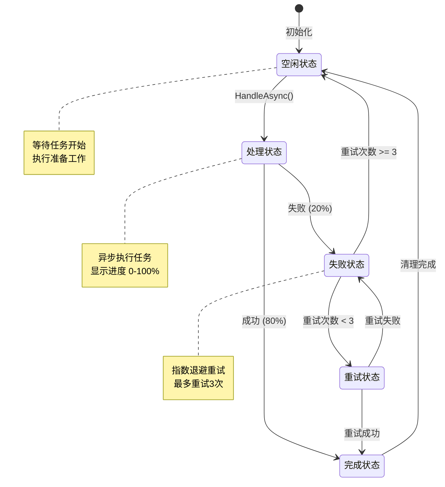
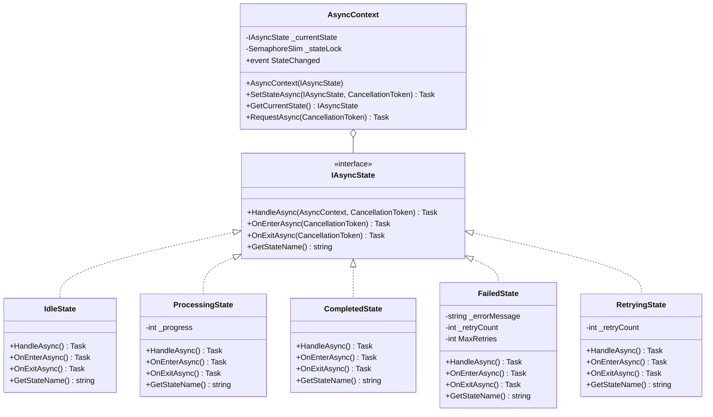
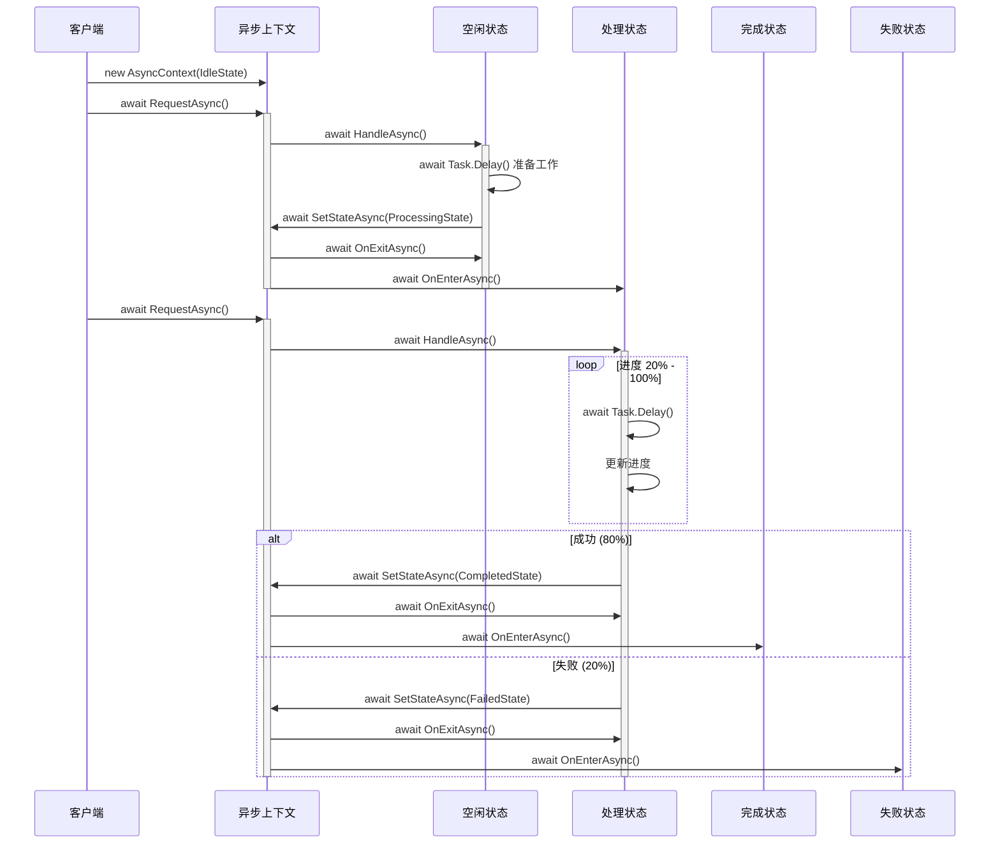

# 异步状态机模式 (Async State Pattern)

## 📋 目录
- [概述](#概述)
- [设计模式说明](#设计模式说明)
- [状态流转图](#状态流转图)
- [类图结构](#类图结构)
- [代码结构](#代码结构)
- [执行流程](#执行流程)
- [核心特性](#核心特性)
- [优缺点分析](#优缺点分析)
- [使用场景](#使用场景)
- [运行示例](#运行示例)

## 概述

异步状态模式是基础状态模式的扩展版本，专门为处理异步操作而设计。它结合了 C# 的 `async/await` 特性，支持非阻塞的状态转换和任务处理。

### 核心思想
- 所有状态操作都是异步的（返回 `Task`）
- 支持取消令牌（`CancellationToken`）
- 提供状态进入/退出的生命周期钩子
- 线程安全的状态转换
- 支持失败重试机制

## 设计模式说明

### 模式组成

1. **IAsyncState (异步状态接口)**
   - `HandleAsync()` - 异步处理请求
   - `OnEnterAsync()` - 进入状态的回调
   - `OnExitAsync()` - 退出状态的回调
   - `GetStateName()` - 获取状态名称

2. **AsyncContext (异步上下文类)**
   - 维护当前状态的引用
   - 使用 `SemaphoreSlim` 保证线程安全
   - 提供状态变更事件 `StateChanged`
   - 支持取消操作

3. **具体状态类**
   - `IdleState` - 空闲状态
   - `ProcessingState` - 处理状态
   - `CompletedState` - 完成状态
   - `FailedState` - 失败状态
   - `RetryingState` - 重试状态

## 状态流转图



## 类图结构



## 代码结构

### 项目文件说明

| 文件名 | 说明 |
|--------|------|
| `IAsyncState.cs` | 异步状态接口定义 |
| `AsyncContext.cs` | 异步上下文类 |
| `States/IdleState.cs` | 空闲状态实现 |
| `States/ProcessingState.cs` | 处理状态实现 |
| `States/CompletedState.cs` | 完成状态实现 |
| `States/FailedState.cs` | 失败状态实现 |
| `States/RetryingState.cs` | 重试状态实现 |
| `Program.cs` | 主程序入口 |
| `AsyncStatePattern.csproj` | 项目配置文件 |

## 执行流程

### 时序图



### 详细流程说明

#### 1. 初始化阶段
```csharp
var context = new AsyncContext(new IdleState());
```
- 创建 AsyncContext 对象
- 设置初始状态为 IdleState
- 初始化线程安全锁

#### 2. 空闲 → 处理
```csharp
await context.RequestAsync(cancellationToken);
```
- IdleState.HandleAsync() 被调用
- 执行 500ms 准备工作
- 调用 OnExitAsync() 退出空闲状态
- 调用 OnEnterAsync() 进入处理状态

#### 3. 处理 → 完成/失败
- ProcessingState.HandleAsync() 被调用
- 循环执行任务，显示进度 20% → 100%
- 随机决定成功（80%）或失败（20%）
- 转换到 CompletedState 或 FailedState

#### 4. 失败 → 重试
- FailedState.HandleAsync() 检查重试次数
- 如果 retryCount < 3，执行指数退避
- 转换到 RetryingState
- RetryingState 尝试重新执行任务

#### 5. 完成 → 空闲
- CompletedState.HandleAsync() 执行清理
- 返回 IdleState 等待下一个任务

## 核心特性

### 1. 异步操作支持

```csharp
public async Task HandleAsync(AsyncContext context, CancellationToken cancellationToken = default)
{
    // 所有 I/O 操作都是异步的
    await Task.Delay(500, cancellationToken);
    
    // 状态转换也是异步的
    await context.SetStateAsync(new ProcessingState(), cancellationToken);
}
```

### 2. 取消令牌支持

```csharp
// 创建取消令牌源
using var cts = new CancellationTokenSource();

// 传递取消令牌
await context.RequestAsync(cts.Token);

// 在状态处理中检查取消
cancellationToken.ThrowIfCancellationRequested();
```

### 3. 生命周期钩子

```csharp
public async Task OnEnterAsync(CancellationToken cancellationToken = default)
{
    // 进入状态时的初始化逻辑
    Console.WriteLine("进入状态");
}

public async Task OnExitAsync(CancellationToken cancellationToken = default)
{
    // 退出状态时的清理逻辑
    Console.WriteLine("退出状态");
}
```

### 4. 线程安全

```csharp
private readonly SemaphoreSlim _stateLock = new(1, 1);

public async Task SetStateAsync(IAsyncState newState, CancellationToken cancellationToken = default)
{
    await _stateLock.WaitAsync(cancellationToken);
    try
    {
        // 安全地切换状态
        _currentState = newState;
    }
    finally
    {
        _stateLock.Release();
    }
}
```

### 5. 状态变更事件

```csharp
public event Func<IAsyncState, IAsyncState, Task>? StateChanged;

// 订阅事件
context.StateChanged += async (previous, current) =>
{
    await LogStateChangeAsync(previous, current);
};
```

### 6. 指数退避重试

```csharp
// 重试延迟：500ms, 1000ms, 2000ms...
var delay = (int)Math.Pow(2, _retryCount) * 500;
await Task.Delay(delay, cancellationToken);
```

## 优缺点分析

### ✅ 优点

1. **非阻塞操作**
   - 所有操作都是异步的
   - 不会阻塞主线程

2. **可取消性**
   - 支持 CancellationToken
   - 可以随时取消长时间运行的操作

3. **生命周期管理**
   - OnEnterAsync/OnExitAsync 钩子
   - 便于资源管理和状态初始化

4. **线程安全**
   - 使用 SemaphoreSlim 保护状态转换
   - 避免竞态条件

5. **可观察性**
   - StateChanged 事件
   - 便于日志记录和监控

6. **错误恢复**
   - 内置重试机制
   - 指数退避策略

### ❌ 缺点

1. **复杂度增加**
   - 比同步版本更复杂
   - 需要理解 async/await

2. **调试困难**
   - 异步代码调试较困难
   - 堆栈跟踪可能不完整

3. **资源管理**
   - 需要正确处理取消
   - 需要正确释放资源

## 使用场景

### 适用情况

1. **网络请求处理**
   - HTTP 请求状态管理
   - WebSocket 连接状态

2. **文件操作**
   - 异步文件读写
   - 大文件上传/下载

3. **数据库操作**
   - 异步查询处理
   - 事务状态管理

4. **后台任务**
   - 长时间运行的任务
   - 需要进度报告的操作

5. **工作流引擎**
   - 异步工作流步骤
   - 审批流程

### 实际应用示例

- **文件上传**: 等待 → 上传中 → 完成/失败 → 重试
- **订单处理**: 创建 → 支付中 → 配送中 → 完成
- **邮件发送**: 队列中 → 发送中 → 已发送/失败
- **数据同步**: 空闲 → 同步中 → 完成/冲突

## 运行示例

### 编译和运行

```bash
# 编译项目
dotnet build

# 运行程序
dotnet run
```

### 预期输出

```
========== 异步状态模式演示 ==========

[10:30:00.000] 初始状态: 空闲状态 (Idle)

========== 第 1 轮任务 ==========

[10:30:00.001] 当前状态: 空闲状态 (Idle)
[10:30:00.002] 空闲状态: 准备开始处理任务...
[10:30:00.502] 空闲状态: 准备完成，开始处理
[10:30:00.503] ← 退出空闲状态
[10:30:00.503] 状态转换: 空闲状态 (Idle) -> 处理状态 (Processing)
[10:30:00.504] → 进入处理状态
[10:30:00.504] [事件] 状态已从 '空闲状态 (Idle)' 变更为 '处理状态 (Processing)'

[10:30:00.505] 当前状态: 处理状态 (Processing)
[10:30:00.506] 处理状态: 开始执行异步任务...
[10:30:00.806] 处理状态: 进度 20%
[10:30:01.106] 处理状态: 进度 40%
[10:30:01.406] 处理状态: 进度 60%
[10:30:01.706] 处理状态: 进度 80%
[10:30:02.006] 处理状态: 进度 100%
[10:30:02.007] 处理状态: 任务处理完成
[10:30:02.007] ← 退出处理状态 (最终进度: 100%)
[10:30:02.008] 状态转换: 处理状态 (Processing) -> 完成状态 (Completed)
[10:30:02.008] → 进入完成状态 ✓

... (继续执行)

========== 演示结束 ==========
```

## 与基础状态机的对比

| 特性 | 基础状态机 | 异步状态机 |
|------|-----------|-----------|
| 操作类型 | 同步 | 异步 |
| 返回类型 | void | Task |
| 取消支持 | ❌ | ✅ |
| 生命周期钩子 | ❌ | ✅ |
| 线程安全 | ❌ | ✅ |
| 事件通知 | ❌ | ✅ |
| 重试机制 | ❌ | ✅ |
| 复杂度 | 低 | 中 |

## 总结

异步状态模式在基础状态模式的基础上，增加了对异步操作的完整支持。它特别适合处理需要网络请求、文件操作或其他 I/O 密集型任务的状态转换场景。通过生命周期钩子、取消令牌和状态变更事件，提供了更强大的控制能力和更好的可观察性。
