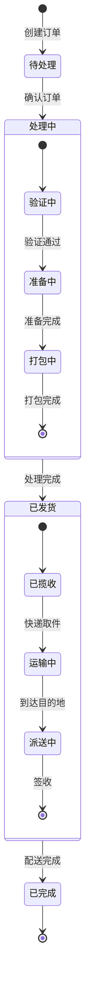
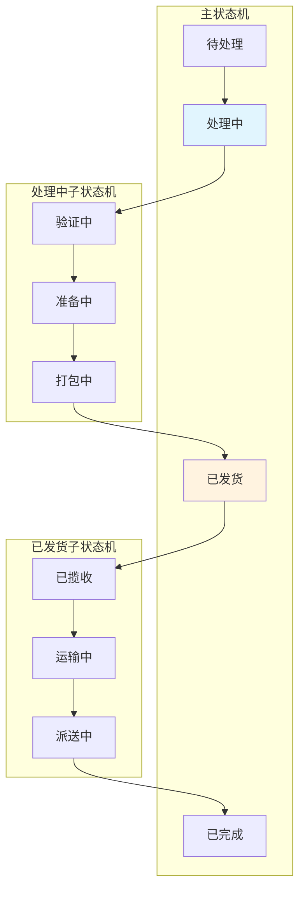
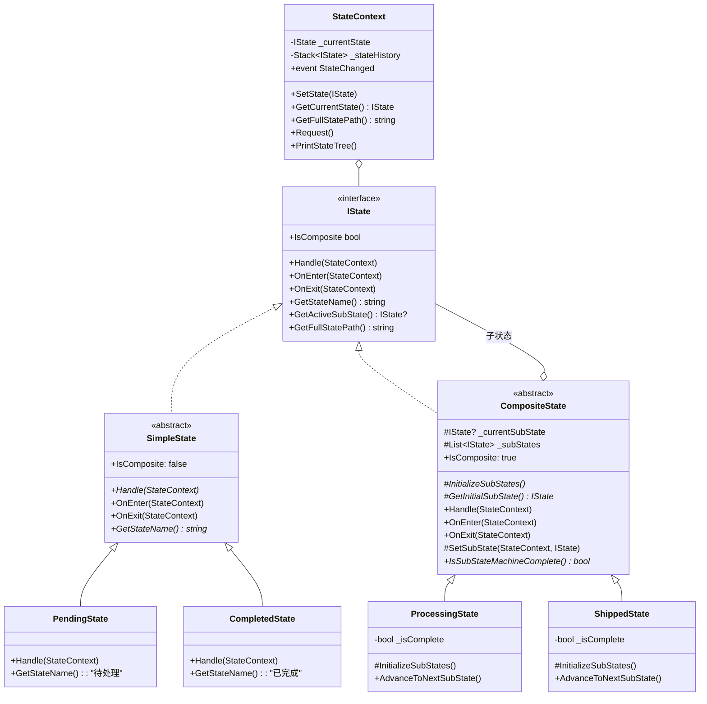
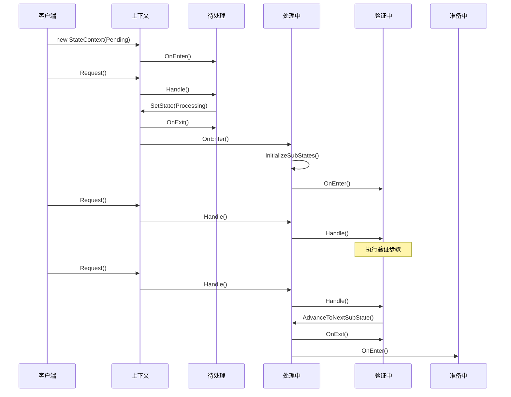

# 嵌套状态机模式 (Nested State Pattern)

## 📋 目录
- [概述](#概述)
- [设计模式说明](#设计模式说明)
- [状态层级结构](#状态层级结构)
- [状态流转图](#状态流转图)
- [类图结构](#类图结构)
- [代码结构](#代码结构)
- [执行流程](#执行流程)
- [核心特性](#核心特性)
- [优缺点分析](#优缺点分析)
- [使用场景](#使用场景)
- [运行示例](#运行示例)

## 概述

嵌套状态机模式（也称为层次状态机 HSM - Hierarchical State Machine）是状态模式的高级扩展。它允许状态包含子状态，形成层级结构，从而更好地组织复杂的状态逻辑。

### 核心思想
- **复合状态**: 状态可以包含子状态机
- **层级结构**: 形成父状态-子状态的树形结构
- **行为继承**: 子状态可以继承父状态的行为
- **职责分离**: 每个层级只关注自己的状态转换

## 设计模式说明

### 模式组成

1. **IState (状态接口)**
   - 定义状态的基本操作
   - 支持查询是否为复合状态
   - 支持获取活动子状态

2. **SimpleState (简单状态基类)**
   - 不包含子状态的叶子状态
   - 直接处理请求

3. **CompositeState (复合状态基类)**
   - 包含子状态机
   - 将请求委托给当前子状态
   - 管理子状态的生命周期

4. **StateContext (状态上下文)**
   - 管理顶层状态
   - 跟踪完整的状态路径
   - 维护状态历史

## 状态层级结构

本示例实现了一个**订单处理系统**，展示嵌套状态机的应用：

```
订单状态机
├── 待处理 (SimpleState)
├── 处理中 (CompositeState) ─────────┐
│   ├── 验证中 (SubState)            │
│   ├── 准备中 (SubState)            │ 子状态机
│   └── 打包中 (SubState)            │
├── 已发货 (CompositeState) ─────────┤
│   ├── 已揽收 (SubState)            │
│   ├── 运输中 (SubState)            │ 子状态机
│   └── 派送中 (SubState)            │
└── 已完成 (SimpleState)        ─────┘
```

## 状态流转图

### 主状态流转



### 详细子状态流转



## 类图结构



## 代码结构

### 项目文件说明

| 文件名 | 说明 |
|--------|------|
| `IState.cs` | 状态接口，定义层级状态的基本操作 |
| `SimpleState.cs` | 简单状态基类（叶子状态） |
| `CompositeState.cs` | 复合状态基类（包含子状态机） |
| `StateContext.cs` | 状态上下文，管理状态层级 |
| `States/PendingState.cs` | 待处理状态 |
| `States/ProcessingState.cs` | 处理中状态（含验证/准备/打包子状态） |
| `States/ShippedState.cs` | 已发货状态（含揽收/运输/派送子状态） |
| `States/CompletedState.cs` | 已完成状态 |
| `Program.cs` | 主程序入口 |

## 执行流程

### 时序图



### 流程说明

1. **初始化**
   - 创建 StateContext，初始状态为"待处理"
   - 调用 OnEnter() 进入初始状态

2. **待处理 → 处理中**
   - Request() 触发状态处理
   - 待处理状态决定转换到处理中
   - 处理中状态初始化子状态机
   - 自动进入第一个子状态"验证中"

3. **子状态推进**
   - 每次 Request() 被委托到当前子状态
   - 子状态完成后调用父状态的 AdvanceToNextSubState()
   - 父状态切换到下一个子状态

4. **子状态机完成**
   - 所有子状态完成后，IsSubStateMachineComplete() 返回 true
   - 父状态决定转换到下一个主状态

## 核心特性

### 1. 复合状态封装

```csharp
public abstract class CompositeState : IState
{
    protected IState? _currentSubState;
    protected readonly List<IState> _subStates = [];
    
    // 将请求委托给当前子状态
    public virtual void Handle(StateContext context)
    {
        _currentSubState?.Handle(context);
    }
}
```

### 2. 生命周期管理

```csharp
public virtual void OnEnter(StateContext context)
{
    // 初始化子状态机
    InitializeSubStates();
    _currentSubState = GetInitialSubState();
    _currentSubState?.OnEnter(context);
}

public virtual void OnExit(StateContext context)
{
    // 退出当前子状态
    _currentSubState?.OnExit(context);
    _currentSubState = null;
}
```

### 3. 状态路径追踪

```csharp
public string GetFullStatePath()
{
    if (_currentSubState != null)
    {
        return $"{GetStateName()} > {_currentSubState.GetFullStatePath()}";
    }
    return GetStateName();
}

// 输出示例: "处理中 > 验证中"
```

### 4. 子状态推进机制

```csharp
public void AdvanceToNextSubState(StateContext context)
{
    var currentIndex = _subStates.IndexOf(_currentSubState);
    if (currentIndex < _subStates.Count - 1)
    {
        SetSubState(context, _subStates[currentIndex + 1]);
    }
    else
    {
        _isComplete = true;
    }
}
```

### 5. 状态树可视化

```csharp
context.PrintStateTree();

// 输出:
// [状态树]
// ● 处理中
//   ● 验证中
```

## 优缺点分析

### ✅ 优点

1. **层级组织**
   - 复杂状态逻辑分层管理
   - 清晰的状态层级结构

2. **封装性**
   - 子状态机的细节对外隐藏
   - 每层只关注自己的逻辑

3. **可复用性**
   - 子状态机可以被复用
   - 复合状态可以组合使用

4. **可维护性**
   - 修改子状态不影响父状态
   - 易于添加新的子状态

5. **行为继承**
   - 子状态可以继承父状态的行为
   - 减少代码重复

### ❌ 缺点

1. **复杂度增加**
   - 层级越深越难理解
   - 调试困难

2. **性能开销**
   - 层级遍历有开销
   - 状态对象较多

3. **设计难度**
   - 需要合理划分层级
   - 子状态与父状态的耦合

## 使用场景

### 适用情况

1. **复杂业务流程**
   - 订单处理（待处理→处理中→发货→完成）
   - 审批流程（多级审批）

2. **游戏开发**
   - 角色状态（站立、行走、攻击中的子动作）
   - AI 行为树

3. **UI 状态管理**
   - 多步骤表单
   - 向导式界面

4. **设备控制**
   - 工业设备状态
   - 嵌入式系统

### 实际应用示例

```
电商订单:
├── 待付款
├── 待发货
│   ├── 待拣货
│   ├── 拣货中
│   └── 待出库
├── 配送中
│   ├── 已揽收
│   ├── 运输中
│   └── 派送中
└── 已完成

游戏角色:
├── 空闲
├── 移动中
│   ├── 行走
│   └── 奔跑
├── 战斗中
│   ├── 攻击
│   ├── 防御
│   └── 施法
└── 死亡
```

## 运行示例

### 编译和运行

```bash
# 编译项目
dotnet build

# 运行程序
dotnet run
```

### 预期输出

```
╔════════════════════════════════════════════════════╗
║         嵌套状态模式演示 - 订单处理系统            ║
╚════════════════════════════════════════════════════╝

[初始化] 状态: 待处理
  → 进入状态: 待处理

┌─────────────────────────────────────────┐
│  步骤 01                                │
└─────────────────────────────────────────┘

[状态树]
● 待处理

=== 处理请求 ===
[当前状态路径] 待处理
  [待处理] 订单已确认，开始处理...
  ← 退出状态: 待处理

[状态转换] 待处理 -> 处理中
  → 进入复合状态: 处理中
    → 进入子状态: 验证中
    [验证中] 开始验证订单信息...
  [事件] 主状态变更: 待处理 → 处理中

┌─────────────────────────────────────────┐
│  步骤 02                                │
└─────────────────────────────────────────┘

[状态树]
● 处理中
  ● 验证中

=== 处理请求 ===
[当前状态路径] 处理中 > 验证中
  [复合状态 处理中] 委托给子状态: 验证中
    [验证中] 执行验证步骤 1/2

... (继续执行直到完成)

╔════════════════════════════════════════════════════╗
║                   订单处理流程结束                 ║
╚════════════════════════════════════════════════════╝

最终状态: 已完成
总步骤数: 15
```

## 与其他模式的对比

| 特性 | 基础状态机 | 异步状态机 | 嵌套状态机 |
|------|-----------|-----------|-----------|
| 状态结构 | 平面 | 平面 | 层级 |
| 子状态支持 | ❌ | ❌ | ✅ |
| 状态继承 | ❌ | ❌ | ✅ |
| 复杂度 | 低 | 中 | 高 |
| 适用场景 | 简单流程 | 异步操作 | 复杂业务 |

## 总结

嵌套状态机模式通过引入状态层级，有效地组织和管理复杂的状态逻辑。它特别适合处理具有多个阶段，每个阶段又包含多个步骤的业务流程。通过将复杂状态分解为可管理的子状态，提高了代码的可维护性和可扩展性。
