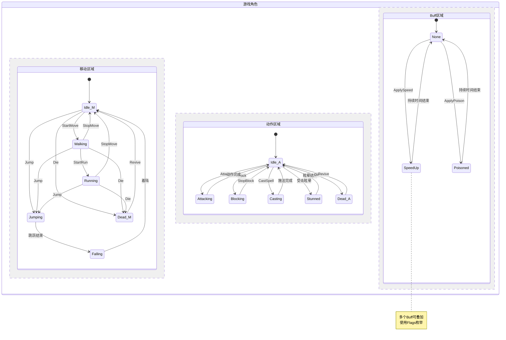
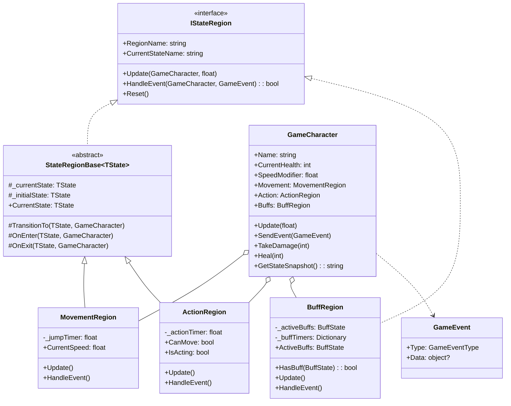
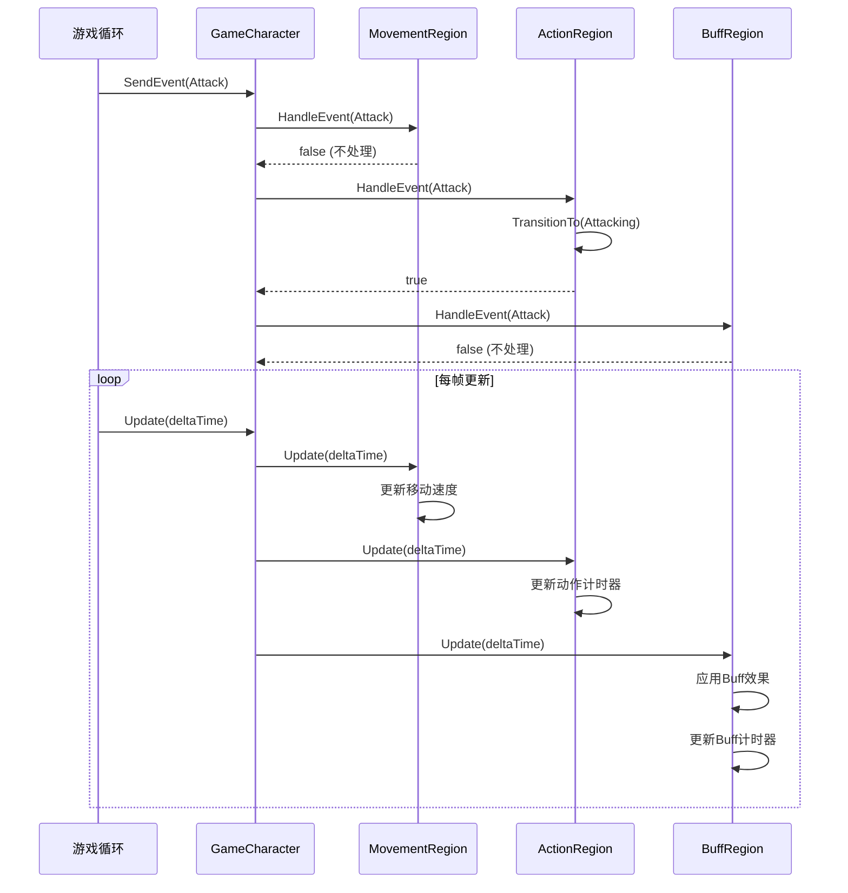

# 并行状态机模式 (Parallel/Orthogonal State Machine)

## 📋 目录
- [概述](#概述)
- [设计模式说明](#设计模式说明)
- [并行状态结构](#并行状态结构)
- [状态区域详解](#状态区域详解)
- [类图结构](#类图结构)
- [代码结构](#代码结构)
- [执行流程](#执行流程)
- [核心特性](#核心特性)
- [优缺点分析](#优缺点分析)
- [使用场景](#使用场景)
- [运行示例](#运行示例)

## 概述

并行状态机（也称为正交状态机 Orthogonal State Machine）允许**多个独立的状态机同时运行**。每个状态机称为一个"状态区域"（State Region），它们可以独立转换状态，但也可以通过事件相互影响。

### 核心思想
- **并行运行**: 多个状态区域同时活动
- **独立转换**: 每个区域有自己的状态转换逻辑
- **事件广播**: 事件发送到所有区域，由各区域决定是否响应
- **状态组合**: 整体状态是各区域状态的组合

## 设计模式说明

### 模式组成

本示例实现了一个**游戏角色状态系统**，包含三个并行的状态区域：

```
┌─────────────────────────────────────────────────────────┐
│                     游戏角色状态机                       │
├──────────────────┬──────────────────┬──────────────────┤
│   移动区域        │   动作区域        │   Buff区域       │
│   (Movement)     │   (Action)       │   (Buff)         │
├──────────────────┼──────────────────┼──────────────────┤
│ ○ Idle 站立      │ ○ Idle 空闲      │ ◇ None 无        │
│ ● Walking 行走   │ ○ Attacking 攻击 │ ◆ SpeedUp 加速   │
│ ○ Running 奔跑   │ ● Blocking 防御  │ ◆ SlowDown 减速  │
│ ○ Jumping 跳跃   │ ○ Casting 施法   │ ◆ Poisoned 中毒  │
│ ○ Falling 下落   │ ○ Stunned 眩晕   │ ◆ Regen 回血     │
│ ○ Dead 死亡      │ ○ Dead 死亡      │ ◆ Invincible 无敌│
└──────────────────┴──────────────────┴──────────────────┘
              ↑              ↑              ↑
              └──────────────┼──────────────┘
                             │
                      事件广播到所有区域
```

## 并行状态结构

### 状态流转图



### 状态组合示例

```
时刻1: [Running] + [Attacking] + [SpeedUp, Poisoned]
       角色正在奔跑中发动攻击，同时有加速和中毒效果

时刻2: [Jumping] + [Idle] + [None]
       角色正在跳跃，动作空闲，无Buff

时刻3: [Idle] + [Blocking] + [Invincible]
       角色站立防御，处于无敌状态
```

## 状态区域详解

### 1. 移动区域 (MovementRegion)

| 状态 | 说明 | 转换条件 |
|------|------|----------|
| Idle | 站立 | 默认状态 |
| Walking | 行走 | StartMove事件 |
| Running | 奔跑 | StartRun事件，速度*2 |
| Jumping | 跳跃中 | Jump事件，持续0.5秒 |
| Falling | 下落中 | 跳跃结束后 |
| Dead | 死亡 | Die事件 |

### 2. 动作区域 (ActionRegion)

| 状态 | 说明 | 持续时间 | 特殊效果 |
|------|------|----------|----------|
| Idle | 空闲 | - | 可执行其他动作 |
| Attacking | 攻击 | 0.8秒 | 造成伤害 |
| Blocking | 防御 | 持续 | 伤害减免66% |
| Casting | 施法 | 1.5秒 | 魔法效果 |
| Stunned | 眩晕 | 1.0秒 | 无法行动 |
| Dead | 死亡 | - | 无法行动 |

### 3. Buff区域 (BuffRegion)

| Buff | 效果 | 默认持续时间 |
|------|------|--------------|
| SpeedUp | 移动速度+50% | 5秒 |
| SlowDown | 移动速度-50% | 3秒 |
| Poisoned | 每秒5点伤害 | 4秒 |
| Regenerating | 每秒回复10HP | 5秒 |
| Invincible | 免疫所有伤害 | 3秒 |

## 类图结构



## 代码结构

### 项目文件说明

| 文件名 | 说明 |
|--------|------|
| `IStateRegion.cs` | 状态区域接口和事件定义 |
| `StateRegionBase.cs` | 状态区域泛型基类 |
| `Regions/MovementRegion.cs` | 移动状态区域 |
| `Regions/ActionRegion.cs` | 动作状态区域 |
| `Regions/BuffRegion.cs` | Buff状态区域（支持叠加） |
| `GameCharacter.cs` | 游戏角色，整合所有状态区域 |
| `Program.cs` | 演示程序 |

## 执行流程

### 时序图



### 事件广播流程

```
1. 用户触发事件 (如: Attack)
2. GameCharacter 接收事件
3. 事件广播到所有区域:
   ├── MovementRegion.HandleEvent() → 不处理攻击
   ├── ActionRegion.HandleEvent()   → 开始攻击动作
   └── BuffRegion.HandleEvent()     → 不处理攻击
4. 各区域独立响应
5. Update循环持续更新各区域状态
```

## 核心特性

### 1. 并行状态更新

```csharp
public void Update(float deltaTime)
{
    // 同时更新所有状态区域
    foreach (var region in _regions)
    {
        region.Update(this, deltaTime);
    }
}
```

### 2. 事件广播机制

```csharp
public void SendEvent(GameEvent gameEvent)
{
    // 事件发送到所有区域，由各区域决定是否响应
    foreach (var region in _regions)
    {
        region.HandleEvent(this, gameEvent);
    }
}
```

### 3. 区域间通信

```csharp
// 动作区域影响移动速度
public override bool HandleEvent(GameCharacter character, GameEvent gameEvent)
{
    if (gameEvent.Type == GameEventType.Block)
    {
        // 防御时降低移动速度
        character.SpeedModifier = 0.3f;
        return true;
    }
}
```

### 4. Buff叠加（Flags枚举）

```csharp
[Flags]
public enum BuffState
{
    None = 0,
    SpeedUp = 1,
    SlowDown = 2,
    Poisoned = 4,
    // ...
}

// 可以同时拥有多个Buff
_activeBuffs |= BuffState.SpeedUp;    // 添加
_activeBuffs &= ~BuffState.SpeedUp;   // 移除
_activeBuffs.HasFlag(BuffState.SpeedUp); // 检查
```

### 5. 状态快照

```csharp
public string GetStateSnapshot()
{
    return $"移动:{Movement.CurrentStateName} | " +
           $"动作:{Action.CurrentStateName} | " +
           $"Buff:{Buffs.CurrentStateName}";
}
// 输出: "移动:Running | 动作:Attacking | Buff:SpeedUp, Poisoned"
```

## 优缺点分析

### ✅ 优点

1. **降低复杂度**
   - 将复杂状态分解为多个简单区域
   - 每个区域独立管理，易于理解

2. **减少状态爆炸**
   - 传统方式: 5×6×5 = 150个组合状态
   - 并行方式: 5 + 6 + 5 = 16个状态

3. **高内聚低耦合**
   - 各区域独立开发和测试
   - 通过事件松散耦合

4. **易于扩展**
   - 添加新区域不影响现有区域
   - 添加新状态只影响所在区域

5. **真实模拟**
   - 更符合现实世界的并行性
   - 如: 人可以同时走路和说话

### ❌ 缺点

1. **同步复杂**
   - 区域间状态依赖处理复杂
   - 需要仔细设计事件机制

2. **调试困难**
   - 并行状态组合多
   - 问题可能跨区域

3. **性能开销**
   - 每帧需要更新所有区域
   - 事件需要广播到所有区域

## 使用场景

### 适用情况

1. **游戏开发**
   - 角色状态（移动/动作/效果）
   - NPC AI（巡逻/战斗/对话）
   - 载具（移动/武器/损坏）

2. **机器人控制**
   - 运动系统 + 感知系统 + 任务系统
   - 各系统独立运行

3. **UI状态管理**
   - 动画状态 + 交互状态 + 数据状态

4. **IoT设备**
   - 网络状态 + 传感器状态 + 执行器状态

### 实际应用示例

```
游戏BOSS:
├── 移动区域: 站立/巡逻/冲刺/传送
├── 攻击区域: 普攻/技能1/技能2/大招
├── 防御区域: 正常/护盾/无敌/虚弱
└── 特效区域: 无/燃烧/冰冻/充能

智能家居:
├── 电源区域: 关闭/待机/运行
├── 网络区域: 断开/连接中/已连接
├── 传感器区域: 空闲/检测中/报警
└── 执行区域: 空闲/执行中/完成
```

## 运行示例

### 编译和运行

```bash
# 编译项目
dotnet build

# 运行程序
dotnet run
```

### 预期输出

```
╔════════════════════════════════════════════════════════╗
║        并行状态机演示 - 游戏角色状态系统              ║
╚════════════════════════════════════════════════════════╝

╔═══════════════════════════════════════════════════════╗
║  角色: 勇者            HP: 100/100  速度: 1.0x       ║
╠═══════════════════════════════════════════════════════╣
║  移动状态: Idle         当前速度: 0.0                ║
║  动作状态: Idle         可移动: 是                   ║
║  Buff状态: 无                                         ║
╚═══════════════════════════════════════════════════════╝

====== 场景1: 基础移动 ======

[勇者] 事件: StartMove
  [移动] Idle → Walking
    → 进入移动状态: Walking
  [状态快照] 移动:Walking | 动作:Idle | Buff:无

[勇者] 事件: StartRun
  [移动] Walking → Running
    → 进入移动状态: Running
  [状态快照] 移动:Running | 动作:Idle | Buff:无

[勇者] 事件: Jump
  [移动] Running → Jumping
    → 进入移动状态: Jumping
  [移动] Jumping → Falling
    → 进入移动状态: Falling
  [移动] Falling → Idle
    → 进入移动状态: Idle

====== 场景6: 并行状态演示 ======
同时进行多个状态:

[勇者] 事件: StartRun
  [移动] Idle → Running

[勇者] 事件: Attack
  [动作] Idle → Attacking
    ⚔️ 发动攻击! 伤害: 15

[勇者] 事件: ApplySpeed
  [Buff] 添加: SpeedUp (5秒)
    ⚡ 获得加速效果! 持续5秒

╔═══════════════════════════════════════════════════════╗
║  角色: 勇者            HP:  80/100  速度: 1.5x       ║
╠═══════════════════════════════════════════════════════╣
║  移动状态: Running      当前速度: 15.0               ║
║  动作状态: Attacking    可移动: 否                   ║
║  Buff状态: SpeedUp                                    ║
╚═══════════════════════════════════════════════════════╝
```

## 与其他模式的对比

| 特性 | 基础状态机 | 嵌套状态机 | 并行状态机 |
|------|-----------|-----------|-----------|
| 状态结构 | 平面 | 层级 | 并行区域 |
| 活动状态数 | 1个 | 1个路径 | 多个(每区域1个) |
| 状态组合 | 无 | 父子关系 | 正交组合 |
| 复杂度管理 | 状态爆炸 | 分层管理 | 分区管理 |
| 适用场景 | 简单流程 | 分阶段流程 | 多维度状态 |

## 总结

并行状态机通过将复杂状态分解为多个独立的状态区域，有效解决了状态爆炸问题。每个区域负责一个维度的状态管理，区域之间通过事件机制通信。这种模式特别适合游戏开发、机器人控制等需要同时管理多个独立状态的场景。
