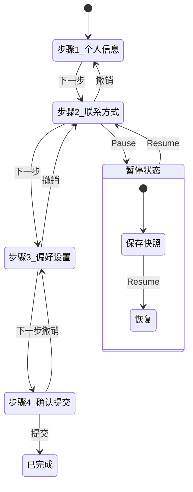
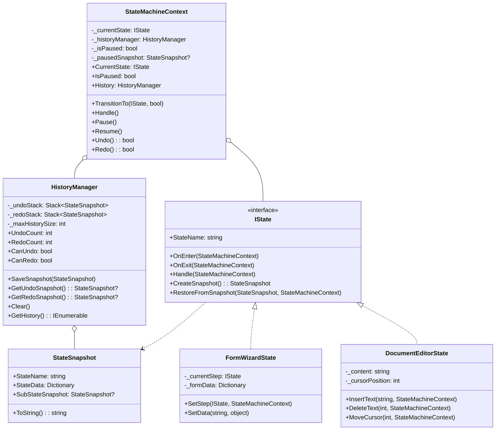

# 历史状态机模式 (History State Machine)

## 📋 目录
- [概述](#概述)
- [设计模式说明](#设计模式说明)
- [历史类型](#历史类型)
- [状态流转图](#状态流转图)
- [类图结构](#类图结构)
- [代码结构](#代码结构)
- [核心特性](#核心特性)
- [使用场景](#使用场景)
- [运行示例](#运行示例)

## 概述

历史状态机是状态模式的扩展，它能够**记住之前的状态**，支持"返回"到先前的状态。这在需要撤销/重做、暂停/恢复、或向导式流程中非常有用。

### 核心思想
- **状态快照**: 记录状态的完整信息
- **历史栈**: 使用栈结构管理历史记录
- **撤销/重做**: 双栈实现 Undo/Redo
- **暂停/恢复**: 临时保存并恢复状态

## 设计模式说明

### 历史状态机的核心组件

```
┌─────────────────────────────────────────────────────────┐
│                    StateMachineContext                   │
├─────────────────────────────────────────────────────────┤
│  ┌─────────────┐    ┌─────────────────────────────┐     │
│  │ CurrentState│    │      HistoryManager         │     │
│  └─────────────┘    ├─────────────────────────────┤     │
│                     │  UndoStack    RedoStack     │     │
│                     │  ┌───┐        ┌───┐         │     │
│                     │  │ S3│        │ S5│         │     │
│                     │  │ S2│        │   │         │     │
│                     │  │ S1│        │   │         │     │
│                     │  └───┘        └───┘         │     │
│                     └─────────────────────────────┘     │
│                                                          │
│  操作:                                                   │
│  - TransitionTo(state) → 保存当前状态到 UndoStack       │
│  - Undo() → 从 UndoStack 弹出，当前状态入 RedoStack    │
│  - Redo() → 从 RedoStack 弹出，当前状态入 UndoStack    │
│  - Pause() → 保存当前状态快照                          │
│  - Resume() → 从快照恢复                               │
└─────────────────────────────────────────────────────────┘
```

## 历史类型

### 浅历史 (Shallow History)

只记住**当前层级**的状态，不包含嵌套子状态的详细信息。

```
恢复前: 主状态A > 子状态2 > 子子状态X
暂停后恢复: 主状态A > 子状态1 (初始子状态)
                      ↑ 子状态重新从初始开始
```

### 深历史 (Deep History)

记住**完整的嵌套状态路径**，恢复时精确还原。

```
恢复前: 主状态A > 子状态2 > 子子状态X
暂停后恢复: 主状态A > 子状态2 > 子子状态X
                      ↑ 完全恢复到离开时的状态
```

## 状态流转图

### 撤销/重做流程

```mermaid
stateDiagram-v2
    state "正常流转" as Normal {
        S1 --> S2: 转换(保存S1)
        S2 --> S3: 转换(保存S2)
        S3 --> S4: 转换(保存S3)
    }
    
    state "撤销操作" as Undo {
        S4 --> S3: Undo
        S3 --> S2: Undo
    }
    
    state "重做操作" as Redo {
        S2 --> S3: Redo
        S3 --> S4: Redo
    }
    
    Normal --> Undo: 用户撤销
    Undo --> Redo: 用户重做
    Undo --> Normal: 新操作(清空Redo)
```

### 表单向导示例



## 类图结构



## 代码结构

### 项目文件说明

| 文件名 | 说明 |
|--------|------|
| `IState.cs` | 状态接口，支持快照创建和恢复 |
| `HistoryManager.cs` | 历史记录管理器（Undo/Redo栈） |
| `StateMachineContext.cs` | 状态机上下文，支持撤销/重做/暂停/恢复 |
| `States/FormWizardStates.cs` | 表单向导示例（多步骤流程） |
| `States/DocumentEditorState.cs` | 文档编辑器示例（文本操作） |
| `Program.cs` | 演示程序 |

## 核心特性

### 1. 状态快照

```csharp
public record StateSnapshot(
    string StateName,
    Dictionary<string, object> StateData,
    StateSnapshot? SubStateSnapshot = null);

// 创建快照
public StateSnapshot CreateSnapshot()
{
    return new StateSnapshot("编辑器", new Dictionary<string, object>
    {
        ["content"] = _content,
        ["cursorPosition"] = _cursorPosition
    });
}
```

### 2. 撤销/重做

```csharp
public bool Undo()
{
    var currentSnapshot = _currentState.CreateSnapshot();
    var previousSnapshot = _historyManager.GetUndoSnapshot(currentSnapshot);
    
    if (previousSnapshot == null) return false;
    
    _currentState.OnExit(this);
    _currentState.RestoreFromSnapshot(previousSnapshot, this);
    return true;
}

public bool Redo()
{
    var currentSnapshot = _currentState.CreateSnapshot();
    var nextSnapshot = _historyManager.GetRedoSnapshot(currentSnapshot);
    
    if (nextSnapshot == null) return false;
    
    _currentState.OnExit(this);
    _currentState.RestoreFromSnapshot(nextSnapshot, this);
    return true;
}
```

### 3. 暂停/恢复

```csharp
public void Pause()
{
    _pausedSnapshot = _currentState.CreateSnapshot();
    _isPaused = true;
}

public void Resume()
{
    if (!_isPaused || _pausedSnapshot == null) return;
    
    _isPaused = false;
    _currentState.RestoreFromSnapshot(_pausedSnapshot, this);
    _pausedSnapshot = null;
}
```

### 4. 深度历史恢复

```csharp
public void RestoreFromSnapshot(StateSnapshot snapshot, StateMachineContext context)
{
    // 恢复当前层级数据
    _formData.Clear();
    foreach (var kvp in snapshot.StateData)
    {
        _formData[kvp.Key] = kvp.Value;
    }
    
    // 递归恢复子状态
    if (snapshot.SubStateSnapshot != null)
    {
        _currentStep = CreateStepFromSnapshot(snapshot.SubStateSnapshot);
        _currentStep.OnEnter(context);
    }
}
```

### 5. 历史记录管理

```csharp
public class HistoryManager
{
    private readonly Stack<StateSnapshot> _undoStack = new();
    private readonly Stack<StateSnapshot> _redoStack = new();
    
    public void SaveSnapshot(StateSnapshot snapshot)
    {
        _undoStack.Push(snapshot);
        _redoStack.Clear(); // 新操作清除重做栈
    }
}
```

## 使用场景

### 适用情况

1. **文档编辑器**
   - 撤销/重做文本操作
   - 版本历史

2. **表单向导**
   - 多步骤表单
   - 返回上一步修改

3. **游戏系统**
   - 游戏存档/读档
   - 回合制游戏悔棋

4. **绘图应用**
   - 撤销绘制操作
   - 图层历史

5. **配置管理**
   - 配置回滚
   - 暂存配置

### 实际应用示例

```
文档编辑器:
├── 输入 "Hello" (保存: "")
├── 输入 " World" (保存: "Hello")
├── 撤销 → 恢复到 "Hello"
├── 撤销 → 恢复到 ""
├── 重做 → 恢复到 "Hello"
└── 输入 " C#" → 清除重做栈

向导表单:
├── 步骤1: 填写姓名 (保存空状态)
├── 步骤2: 填写邮箱 (保存步骤1)
├── [暂停] - 用户离开
├── [恢复] - 回到步骤2
├── 撤销 → 回到步骤1
└── 继续完成...
```

## 运行示例

### 编译和运行

```bash
dotnet build
dotnet run
```

### 预期输出

```
╔════════════════════════════════════════════════════════╗
║           历史状态机演示 - 支持撤销/重做              ║
╚════════════════════════════════════════════════════════╝


========== 演示1: 表单向导 (带暂停/恢复) ==========

[初始化] 状态: 表单向导(步骤1-个人信息), 历史类型: Deep
  → 进入: 表单向导(步骤1-个人信息)
    → 进入步骤: 步骤1-个人信息

╔═══════════════════════════════════════════════════════╗
║  当前状态: 表单向导(步骤1-个人信息)                   ║
║  暂停状态: 否     可撤销: 0    可重做: 0              ║
╚═══════════════════════════════════════════════════════╝

--- 填写步骤1 ---

[处理] 当前状态: 表单向导(步骤1-个人信息)
    [步骤1] 填写个人信息...
  [数据] 姓名 = 张三
  [数据] 年龄 = 28
    ← 退出步骤: 步骤1-个人信息
  [步骤] 步骤1-个人信息 → 步骤2-联系方式
    → 进入步骤: 步骤2-联系方式

--- 用户暂时离开，暂停状态机 ---

[暂停] 保存状态: 表单向导 > 步骤2-联系方式

--- 用户返回，恢复状态机 ---

[恢复] 恢复到状态: 表单向导 > 步骤2-联系方式
  [恢复] 状态: 表单向导(步骤2-联系方式)
  [恢复] 数据: 姓名=张三, 年龄=28

--- 撤销：回到上一步 ---

[撤销] 表单向导 > 步骤2-联系方式 → 表单向导 > 步骤1-个人信息
  [恢复] 状态: 表单向导(步骤1-个人信息)
  [恢复] 数据: 

========== 演示2: 文档编辑器 (撤销/重做) ==========

--- 输入 'Hello' ---

[状态转换] 编辑器(字数:0) → 编辑器(字数:5)
  [编辑器] 当前内容: "Hello"

--- 撤销 (移除 'Hello') ---

[撤销] 编辑器 → 编辑器
  [恢复] 内容: "", 光标: 0
  [编辑器] 当前内容: ""
```

## 与其他模式的对比

| 特性 | 基础状态机 | 嵌套状态机 | 并行状态机 | 历史状态机 |
|------|-----------|-----------|-----------|-----------|
| 撤销支持 | ❌ | ❌ | ❌ | ✅ |
| 重做支持 | ❌ | ❌ | ❌ | ✅ |
| 暂停/恢复 | ❌ | ❌ | ❌ | ✅ |
| 状态快照 | ❌ | ❌ | ❌ | ✅ |
| 深度历史 | ❌ | ❌ | ❌ | ✅ |
| 适用场景 | 简单流程 | 层级流程 | 并行维度 | 需要回溯 |

## 总结

历史状态机通过引入状态快照和历史管理，为状态机增加了"时间旅行"的能力。它特别适合需要撤销/重做功能的应用场景，如文档编辑器、表单向导、游戏存档等。深度历史特性确保了复杂嵌套状态也能完整恢复。
