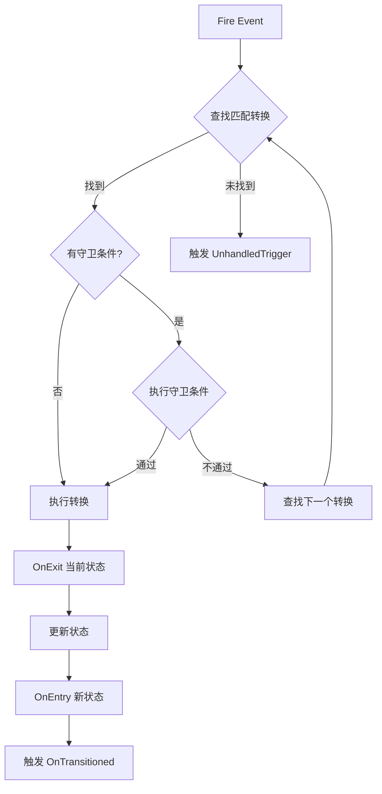
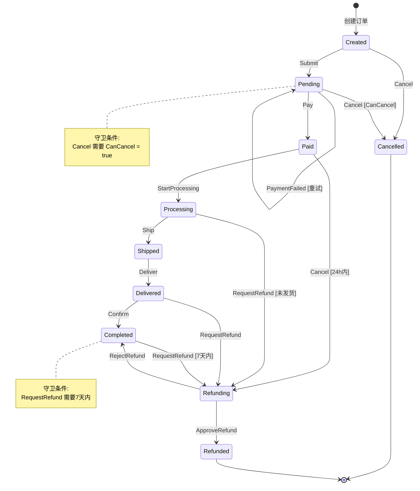
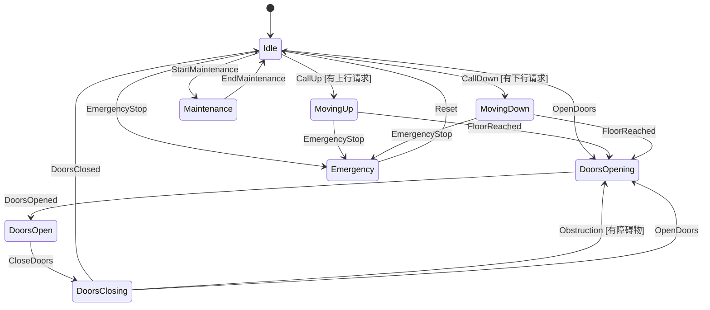
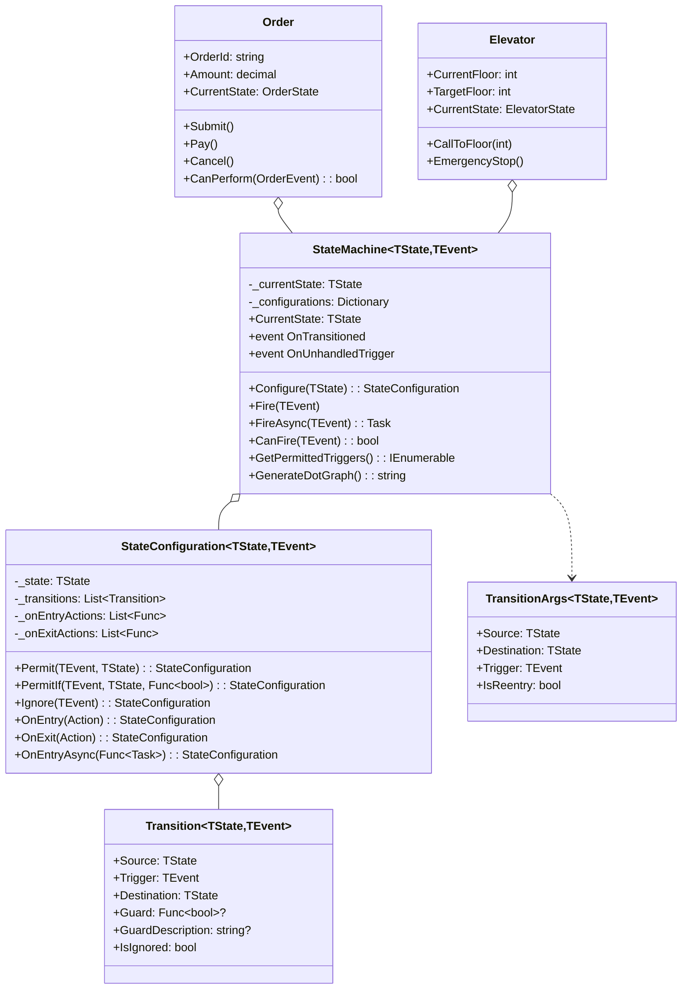

# 事件驱动状态机 (Event-Driven State Machine)

## 📋 目录
- [概述](#概述)
- [设计模式说明](#设计模式说明)
- [流式配置API](#流式配置api)
- [守卫条件](#守卫条件)
- [状态流转图](#状态流转图)
- [类图结构](#类图结构)
- [代码结构](#代码结构)
- [核心特性](#核心特性)
- [使用场景](#使用场景)
- [运行示例](#运行示例)

## 概述

事件驱动状态机采用**声明式配置**方式定义状态转换，支持**守卫条件**（Guard Conditions）来控制转换是否允许执行。这种模式类似于流行的状态机库如 Stateless。

### 核心思想
- **声明式配置**: 使用流式API定义状态和转换
- **事件触发**: 通过 Fire(event) 触发状态转换
- **守卫条件**: 转换前检查条件是否满足
- **动作回调**: OnEntry/OnExit 钩子函数
- **类型安全**: 使用泛型枚举定义状态和事件

## 设计模式说明

### 核心组件

```
┌─────────────────────────────────────────────────────────┐
│               StateMachine<TState, TEvent>              │
├─────────────────────────────────────────────────────────┤
│  CurrentState: TState                                   │
│  Configurations: Dictionary<TState, StateConfiguration> │
├─────────────────────────────────────────────────────────┤
│  Configure(state) → StateConfiguration                  │
│  Fire(event) → 触发转换                                 │
│  CanFire(event) → 检查是否可触发                        │
│  GetPermittedTriggers() → 获取可用事件                  │
└─────────────────────────────────────────────────────────┘
                          │
                          ▼
┌─────────────────────────────────────────────────────────┐
│              StateConfiguration<TState, TEvent>         │
├─────────────────────────────────────────────────────────┤
│  Permit(event, destination)         无条件转换          │
│  PermitIf(event, dest, guard)       带守卫条件转换      │
│  Ignore(event)                      忽略事件            │
│  OnEntry(action)                    进入动作            │
│  OnExit(action)                     退出动作            │
└─────────────────────────────────────────────────────────┘
```

## 流式配置API

### 基本用法

```csharp
var machine = new StateMachine<OrderState, OrderEvent>(OrderState.Created);

machine.Configure(OrderState.Created)
    .Permit(OrderEvent.Submit, OrderState.Pending)
    .Permit(OrderEvent.Cancel, OrderState.Cancelled)
    .OnEntry(() => Console.WriteLine("订单已创建"))
    .OnExit(() => Console.WriteLine("离开创建状态"));

machine.Configure(OrderState.Pending)
    .Permit(OrderEvent.Pay, OrderState.Paid)
    .PermitIf(OrderEvent.Cancel, OrderState.Cancelled,
        () => CanCancel,
        "检查是否可取消")
    .Ignore(OrderEvent.Submit);
```

### API 方法说明

| 方法 | 说明 | 示例 |
|------|------|------|
| `Permit(event, dest)` | 无条件转换 | `.Permit(Event.Submit, State.Pending)` |
| `PermitIf(event, dest, guard)` | 带条件转换 | `.PermitIf(Event.Cancel, State.Cancelled, () => CanCancel)` |
| `Ignore(event)` | 忽略事件 | `.Ignore(Event.Submit)` |
| `OnEntry(action)` | 进入回调 | `.OnEntry(() => Log("进入"))` |
| `OnExit(action)` | 退出回调 | `.OnExit(() => Log("退出"))` |
| `OnEntryAsync(action)` | 异步进入 | `.OnEntryAsync(async () => await LoadAsync())` |

## 守卫条件

### 什么是守卫条件

守卫条件是一个返回 bool 的函数，用于在运行时决定转换是否可以执行。

```csharp
.PermitIf(OrderEvent.Cancel, OrderState.Cancelled,
    guard: () => DateTime.Now.Hour < 18,      // 守卫条件
    guardDescription: "18点前可取消")          // 条件描述
```

### 守卫条件执行流程



## 状态流转图

### 订单状态机



### 电梯状态机



## 类图结构



## 代码结构

### 项目文件说明

| 文件名 | 说明 |
|--------|------|
| `StateConfiguration.cs` | 状态配置类，流式API实现 |
| `StateMachine.cs` | 状态机核心类 |
| `Examples/OrderStateMachine.cs` | 订单状态机示例 |
| `Examples/ElevatorStateMachine.cs` | 电梯控制系统示例 |
| `Program.cs` | 演示程序 |

## 核心特性

### 1. 类型安全的状态和事件

```csharp
public enum OrderState { Created, Pending, Paid, ... }
public enum OrderEvent { Submit, Pay, Cancel, ... }

var machine = new StateMachine<OrderState, OrderEvent>(OrderState.Created);
```

### 2. 流式配置

```csharp
machine.Configure(OrderState.Pending)
    .Permit(OrderEvent.Pay, OrderState.Paid)
    .PermitIf(OrderEvent.Cancel, OrderState.Cancelled, 
        () => CanCancel, "可取消检查")
    .OnEntry(() => Console.WriteLine("等待支付"))
    .OnExit(() => Console.WriteLine("离开待支付"));
```

### 3. 守卫条件

```csharp
// 带条件的转换
.PermitIf(OrderEvent.RequestRefund, OrderState.Refunding,
    guard: () => (DateTime.Now - CompletedAt.Value).TotalDays <= 7,
    guardDescription: "7天内可申请退款")
```

### 4. 忽略事件

```csharp
// 某些状态下忽略特定事件
machine.Configure(ElevatorState.DoorsOpen)
    .Ignore(ElevatorEvent.OpenDoors); // 门已开，忽略开门请求
```

### 5. 事件订阅

```csharp
machine.OnTransitioned += (sender, args) =>
{
    Console.WriteLine($"状态变更: {args.Source} → {args.Destination}");
};

machine.OnUnhandledTrigger += (sender, args) =>
{
    Console.WriteLine($"未处理事件: {args.Trigger} in {args.State}");
};
```

### 6. 查询能力

```csharp
// 检查是否可以触发
bool canCancel = machine.CanFire(OrderEvent.Cancel);

// 获取可用事件列表
var availableEvents = machine.GetPermittedTriggers();
```

### 7. 状态图生成

```csharp
// 生成 DOT 格式状态图
string dotGraph = machine.GenerateDotGraph();
// 可用 Graphviz 渲染
```

## 使用场景

### 适用情况

1. **订单系统**
   - 复杂的订单状态流转
   - 多种取消/退款规则

2. **工作流引擎**
   - 审批流程
   - 文档状态管理

3. **设备控制**
   - 电梯/门禁系统
   - 工业设备状态

4. **游戏逻辑**
   - 游戏状态机
   - NPC AI 状态

5. **协议处理**
   - 网络协议状态
   - 通信协议

### 与硬编码对比

```csharp
// ❌ 硬编码方式
public void Cancel()
{
    if (State == OrderState.Pending && CanCancel)
        State = OrderState.Cancelled;
    else if (State == OrderState.Paid && CanCancel)
        State = OrderState.Refunding;
    // ... 大量 if-else
}

// ✅ 声明式配置
machine.Configure(OrderState.Pending)
    .PermitIf(OrderEvent.Cancel, OrderState.Cancelled, () => CanCancel);
machine.Configure(OrderState.Paid)
    .PermitIf(OrderEvent.Cancel, OrderState.Refunding, () => CanCancel);
```

## 运行示例

### 编译和运行

```bash
dotnet build
dotnet run
```

### 预期输出

```
╔════════════════════════════════════════════════════════╗
║       事件驱动状态机演示 - 带守卫条件的状态转换        ║
╚════════════════════════════════════════════════════════╝


========== 演示1: 订单状态机 ==========

  ┌─────────────────────────────────────────┐
  │ 订单: ORD-2024-001    状态: Created    │
  │ 金额: ¥299.99   已支付: 否             │
  │ 可用操作: Submit, Cancel               │
  └─────────────────────────────────────────┘

--- 正常订单流程 ---

[事件] Submit (当前状态: Created)
    ← 离开创建状态
  [转换] Created → Pending
    💰 等待支付，金额: ¥299.99
  [订单状态变更] Created → Pending (触发: Submit)

[事件] Pay (当前状态: Pending)
    ← 离开待支付状态
  [转换] Pending → Paid
    ✅ 支付成功! 时间: 10:30:00
  [订单状态变更] Pending → Paid (触发: Pay)

[事件] Cancel (当前状态: Completed)
  [守卫] 7天内可申请退款: 不通过
  [警告] 当前状态 Completed 不能处理事件 Cancel


========== 演示2: 电梯控制系统 ==========

[呼叫] 请求到达楼层: 5

[事件] CallUp (当前状态: Idle)
  [守卫] 有向上请求: 通过
  [转换] Idle → MovingUp
    ⬆️ 电梯上升中: 1 → 5
  [电梯状态] Idle → MovingUp

[事件] FloorReached (当前状态: MovingUp)
    📍 到达楼层: 5
  [转换] MovingUp → DoorsOpening
    🚪 门正在打开...

--- 障碍物检测 ---

[事件] Obstruction (当前状态: DoorsClosing)
  [守卫] 检测到障碍物: 通过
  [转换] DoorsClosing → DoorsOpening
    🚪 门正在打开...
```

## 与其他模式的对比

| 特性 | 基础状态机 | 事件驱动状态机 |
|------|-----------|---------------|
| 配置方式 | 类继承 | 流式API |
| 类型安全 | 接口约束 | 泛型枚举 |
| 守卫条件 | 手动实现 | 内置支持 |
| 状态查询 | 自定义 | CanFire/GetPermittedTriggers |
| 代码位置 | 分散在状态类 | 集中配置 |
| 状态图生成 | 不支持 | 内置支持 |

## 总结

事件驱动状态机通过流式API提供了声明式的状态配置方式，守卫条件使得复杂的业务规则可以优雅地集成到状态转换中。这种模式特别适合需要灵活配置和运行时检查的业务场景，如订单系统、工作流引擎等。
