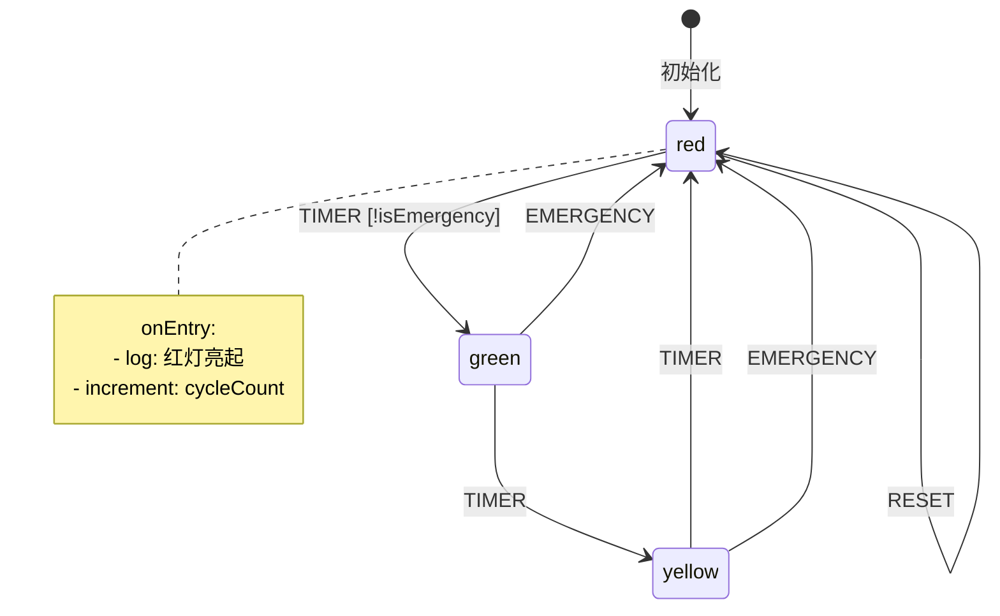
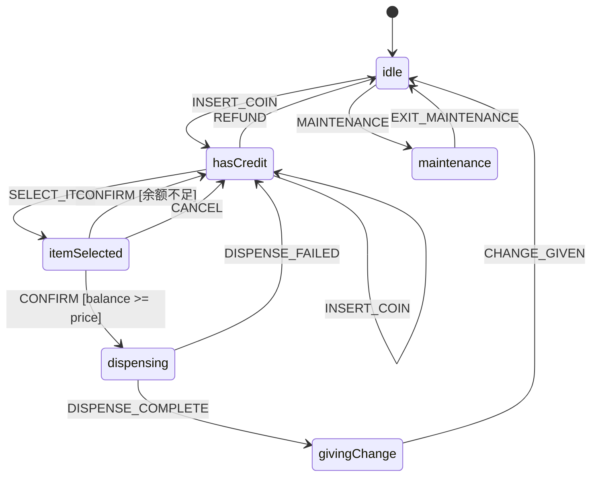
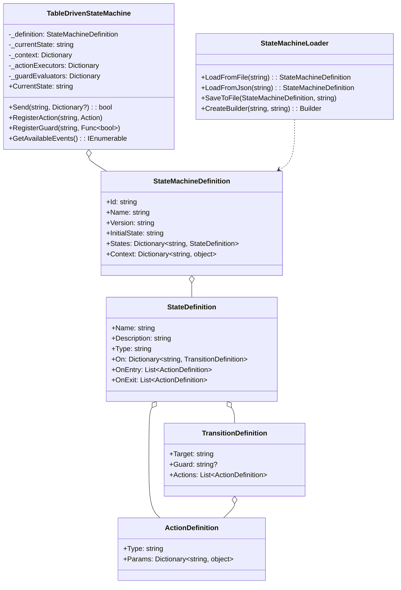

# 表驱动状态机 (Table-Driven State Machine)

## 📋 目录
- [概述](#概述)
- [设计模式说明](#设计模式说明)
- [配置格式](#配置格式)
- [构建器API](#构建器api)
- [状态流转图](#状态流转图)
- [类图结构](#类图结构)
- [代码结构](#代码结构)
- [核心特性](#核心特性)
- [使用场景](#使用场景)
- [运行示例](#运行示例)

## 概述

表驱动状态机将**状态机定义与代码分离**，使用配置文件（如JSON）定义状态、转换和动作。这种模式支持运行时动态修改状态机，无需重新编译代码。

### 核心思想
- **配置化定义**: 使用JSON/YAML定义状态机
- **解释器模式**: 运行时解析配置并执行
- **动态修改**: 支持热更新状态机定义
- **动作系统**: 可扩展的动作处理器

## 设计模式说明

### 核心架构

```
┌─────────────────────────────────────────────────────────┐
│                   配置层 (JSON/YAML)                    │
├─────────────────────────────────────────────────────────┤
│  {                                                       │
│    "id": "traffic-light",                               │
│    "initialState": "red",                               │
│    "states": {                                          │
│      "red": { "on": { "TIMER": { "target": "green" } }} │
│    }                                                     │
│  }                                                       │
└──────────────────────────┬──────────────────────────────┘
                           │ 加载/解析
                           ▼
┌─────────────────────────────────────────────────────────┐
│              StateMachineDefinition (模型)               │
├─────────────────────────────────────────────────────────┤
│  States: Dictionary<string, StateDefinition>            │
│  InitialState: string                                   │
│  Context: Dictionary<string, object>                    │
└──────────────────────────┬──────────────────────────────┘
                           │ 创建
                           ▼
┌─────────────────────────────────────────────────────────┐
│            TableDrivenStateMachine (解释器)              │
├─────────────────────────────────────────────────────────┤
│  Send(event) → 查找转换 → 执行动作 → 更新状态           │
│  ActionExecutors: 动作处理器注册表                      │
│  GuardEvaluators: 守卫条件注册表                        │
└─────────────────────────────────────────────────────────┘
```

## 配置格式

### JSON配置示例

```json
{
  "id": "traffic-light",
  "name": "交通灯状态机",
  "version": "1.0",
  "initialState": "red",
  "context": {
    "cycleCount": 0,
    "isEmergency": false
  },
  "states": {
    "red": {
      "name": "红灯",
      "description": "停止通行",
      "type": "normal",
      "onEntry": [
        { "type": "log", "params": { "message": "🔴 红灯亮起" } },
        { "type": "increment", "params": { "key": "cycleCount" } }
      ],
      "onExit": [
        { "type": "log", "params": { "message": "离开红灯状态" } }
      ],
      "on": {
        "TIMER": {
          "target": "green",
          "guard": "!isEmergency",
          "actions": [
            { "type": "log", "params": { "message": "切换到绿灯" } }
          ]
        },
        "EMERGENCY": {
          "target": "red",
          "actions": [
            { "type": "assign", "params": { "isEmergency": true } }
          ]
        }
      }
    },
    "green": { ... },
    "yellow": { ... }
  }
}
```

### 配置字段说明

| 字段 | 说明 | 必填 |
|------|------|------|
| `id` | 状态机唯一标识 | 是 |
| `name` | 状态机名称 | 是 |
| `version` | 版本号 | 否 |
| `initialState` | 初始状态 | 是 |
| `context` | 上下文数据 | 否 |
| `states` | 状态定义字典 | 是 |

### 状态定义

| 字段 | 说明 |
|------|------|
| `name` | 状态名称 |
| `description` | 状态描述 |
| `type` | 类型: normal/initial/final |
| `on` | 事件处理器字典 |
| `onEntry` | 进入动作列表 |
| `onExit` | 退出动作列表 |

### 转换定义

| 字段 | 说明 |
|------|------|
| `target` | 目标状态 |
| `guard` | 守卫条件表达式 |
| `actions` | 转换动作列表 |

## 构建器API

### 流式API示例

```csharp
var definition = StateMachineLoader.CreateBuilder("vending-machine", "自动售货机")
    .WithVersion("1.0")
    .WithInitialState("idle")
    .WithContext("balance", 0)
    .AddState("idle")
        .WithDescription("等待投币")
        .OnEntry("log", new() { ["message"] = "请投币" })
        .On("INSERT_COIN", "hasCredit")
    .AddState("hasCredit")
        .On("SELECT_ITEM", "dispensing", "balance > price")
        .On("REFUND", "idle")
    .AddState("dispensing")
        .OnEntry("delay", new() { ["ms"] = 500 })
        .On("COMPLETE", "idle")
        .AsFinal()
    .Build();
```

## 状态流转图

### 交通灯状态机



### 自动售货机状态机



## 类图结构



## 代码结构

### 项目文件说明

| 文件名 | 说明 |
|--------|------|
| `StateMachineDefinition.cs` | 状态机定义模型（JSON可序列化） |
| `TableDrivenStateMachine.cs` | 状态机解释器 |
| `StateMachineLoader.cs` | 加载器和构建器 |
| `Configs/traffic-light.json` | 交通灯配置示例 |
| `Configs/vending-machine.json` | 自动售货机配置示例 |
| `Program.cs` | 演示程序 |

## 核心特性

### 1. JSON配置加载

```csharp
// 从文件加载
var definition = StateMachineLoader.LoadFromFile("config.json");

// 从JSON字符串加载
var definition = StateMachineLoader.LoadFromJson(jsonString);
```

### 2. 内置动作处理器

```csharp
// 日志
{ "type": "log", "params": { "message": "Hello ${name}" } }

// 赋值
{ "type": "assign", "params": { "count": 10 } }

// 计数器
{ "type": "increment", "params": { "key": "count", "amount": 1 } }

// 延迟
{ "type": "delay", "params": { "ms": 500 } }

// 调用服务
{ "type": "invoke", "params": { "service": "paymentService" } }
```

### 3. 自定义动作

```csharp
machine.RegisterAction("sendEmail", (context, action) =>
{
    var to = action.Params["to"].ToString();
    var subject = action.Params["subject"].ToString();
    EmailService.Send(to, subject);
});
```

### 4. 守卫条件表达式

```csharp
// 相等比较
"guard": "status == \"active\""

// 数值比较
"guard": "balance > 100"
"guard": "count < 10"

// 布尔取反
"guard": "!isLocked"

// 自定义守卫
machine.RegisterGuard("isBusinessHours", ctx =>
{
    var hour = DateTime.Now.Hour;
    return hour >= 9 && hour < 18;
});
```

### 5. 上下文变量插值

```csharp
// 在消息中使用上下文变量
{ "type": "log", "params": { "message": "余额: ${balance} 元" } }
```

### 6. 动态修改

```csharp
// 添加新状态
definition.States["newState"] = new StateDefinition
{
    Name = "新状态",
    On = new() { ["EVENT"] = new() { Target = "nextState" } }
};

// 修改转换
definition.States["existingState"].On["EVENT"].Target = "differentState";

// 重新创建状态机
var newMachine = new TableDrivenStateMachine(definition);
```

## 使用场景

### 适用情况

1. **可配置工作流**
   - 审批流程
   - 业务流程引擎

2. **规则引擎**
   - 业务规则配置
   - 决策树

3. **游戏配置**
   - 任务流程
   - 剧情分支

4. **IoT设备**
   - 设备状态配置
   - 远程更新

5. **多租户系统**
   - 每个租户不同的流程配置

### 对比

| 方式 | 优点 | 缺点 |
|------|------|------|
| 硬编码 | 类型安全，性能好 | 修改需重新编译 |
| 表驱动 | 热更新，灵活 | 运行时解析开销 |

## 运行示例

### 编译和运行

```bash
dotnet build
dotnet run
```

### 预期输出

```
╔════════════════════════════════════════════════════════╗
║         表驱动状态机演示 - 配置化状态定义             ║
╚════════════════════════════════════════════════════════╝


========== 演示1: 交通灯状态机 (JSON配置) ==========

╔═══════════════════════════════════════════════════════╗
║ 状态机: 交通灯状态机          版本: 1.0              ║
║ 当前状态: red                                         ║
║ 可用事件: TIMER, EMERGENCY, RESET                     ║
╠═══════════════════════════════════════════════════════╣
║ 上下文数据:                                           ║
║   cycleCount     : 0                                  ║
║   isEmergency    : False                              ║
╚═══════════════════════════════════════════════════════╝

--- 正常交通灯循环 ---

[EVENT] TIMER (当前状态: red)
  [GUARD] 守卫条件 '!isEmergency' 通过
    [LOG] 计时结束，准备切换到绿灯
  [TRANSITION] red → green
    [LOG] 🟢 绿灯亮起 - 请通行
  [状态变更] red → green (事件: TIMER)

--- 紧急模式 ---

[EVENT] EMERGENCY (当前状态: green)
    [ASSIGN] isEmergency = True
  [TRANSITION] green → red
    [LOG] 🔴 红灯亮起 - 请停车等待
    [INCREMENT] cycleCount += 1 (现在: 3)

[EVENT] TIMER (当前状态: red)
  [GUARD] 守卫条件 '!isEmergency' 不满足


========== 演示3: 动态修改状态机 ==========

--- 原始状态机 ---
{
  "id": "workflow",
  "name": "工作流",
  ...
}

--- 修改后的状态机 ---

[EVENT] SUBMIT (当前状态: draft)
  [TRANSITION] draft → reviewing
    [LOG] 🔍 开始人工审核
```

## 总结

表驱动状态机通过将状态机定义外部化为配置文件，实现了状态逻辑与代码的解耦。这种模式特别适合需要频繁修改状态流程或支持多种配置的场景。通过可扩展的动作系统和守卫条件，可以灵活地定义复杂的业务逻辑。
