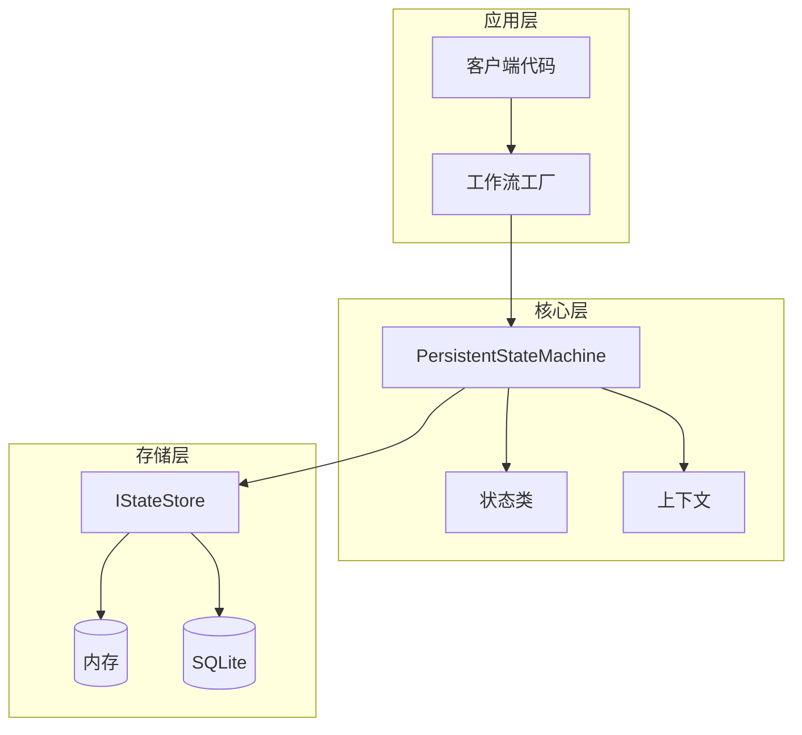
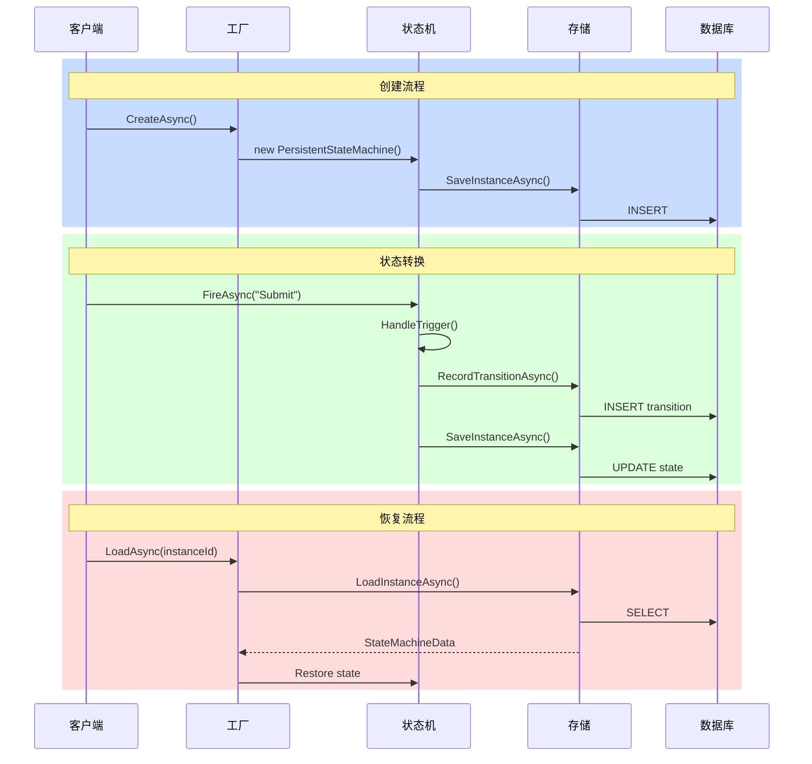
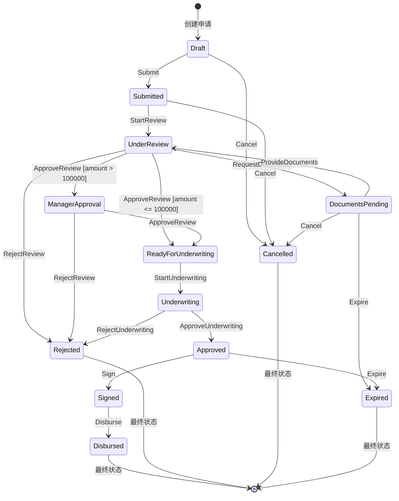
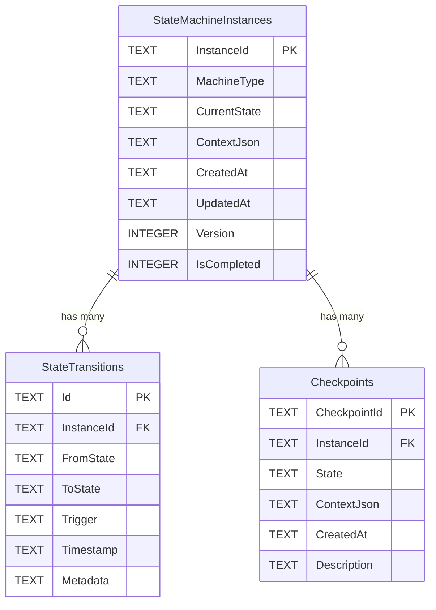
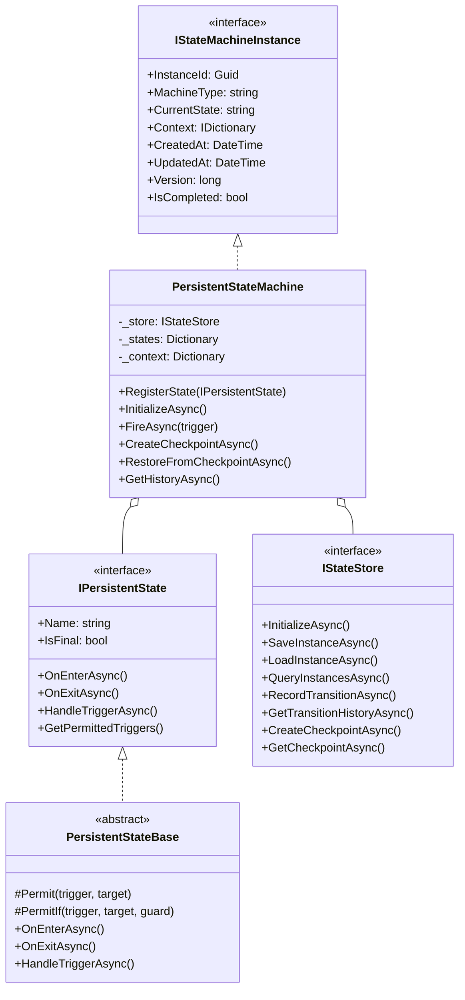

# 持久化状态机 (Persistent State Machine)

## 📋 目录
- [概述](#概述)
- [企业级特性](#企业级特性)
- [架构设计](#架构设计)
- [状态流转图](#状态流转图)
- [数据库设计](#数据库设计)
- [核心组件](#核心组件)
- [使用示例](#使用示例)
- [检查点与恢复](#检查点与恢复)
- [运行演示](#运行演示)

## 概述

持久化状态机将**状态机实例持久化到数据库**，支持系统重启后恢复、检查点回滚、完整的审计日志。这是企业级应用中必不可少的能力，特别适用于长时间运行的业务流程。

### 核心能力

| 特性 | 描述 |
|------|------|
| **持久化存储** | 状态和上下文自动保存到数据库 |
| **检查点恢复** | 创建快照，支持回滚到任意检查点 |
| **转换历史** | 记录完整的状态转换审计日志 |
| **乐观锁** | 版本号机制防止并发冲突 |
| **可插拔存储** | 支持内存、SQLite、可扩展到其他数据库 |

## 企业级特性

### 1. 存储抽象

```csharp
public interface IStateStore
{
    // 实例管理
    Task SaveInstanceAsync(StateMachineData data, CancellationToken ct);
    Task<StateMachineData?> LoadInstanceAsync(Guid instanceId, CancellationToken ct);
    Task<IReadOnlyList<StateMachineData>> QueryInstancesAsync(...);
    
    // 转换历史
    Task RecordTransitionAsync(StateTransitionRecord record, CancellationToken ct);
    Task<IReadOnlyList<StateTransitionRecord>> GetTransitionHistoryAsync(Guid instanceId, CancellationToken ct);
    
    // 检查点
    Task CreateCheckpointAsync(StateMachineCheckpoint checkpoint, CancellationToken ct);
    Task<StateMachineCheckpoint?> GetCheckpointAsync(Guid checkpointId, CancellationToken ct);
}
```

### 2. 多种存储实现

```
┌──────────────────────────────────────────────────────────────┐
│                        IStateStore                           │
└──────────────────────────────────────────────────────────────┘
                              ▲
                              │ 实现
        ┌─────────────────────┼─────────────────────┐
        │                     │                     │
┌───────┴───────┐   ┌────────┴────────┐   ┌────────┴────────┐
│ InMemoryStore │   │  SqliteStore    │   │  SqlServerStore │
│   (开发/测试) │   │   (轻量级)      │   │    (生产级)     │
└───────────────┘   └─────────────────┘   └─────────────────┘
```

## 架构设计

### 整体架构



### 状态机生命周期



## 状态流转图

### 贷款审批流程



## 数据库设计

### ER图



### 表结构

#### StateMachineInstances（状态机实例表）

| 字段 | 类型 | 说明 |
|------|------|------|
| InstanceId | TEXT | 主键，实例唯一标识 |
| MachineType | TEXT | 状态机类型 |
| CurrentState | TEXT | 当前状态 |
| ContextJson | TEXT | 上下文数据（JSON） |
| CreatedAt | TEXT | 创建时间（ISO 8601） |
| UpdatedAt | TEXT | 更新时间（ISO 8601） |
| Version | INTEGER | 版本号（乐观锁） |
| IsCompleted | INTEGER | 是否已完成 |

#### StateTransitions（转换历史表）

| 字段 | 类型 | 说明 |
|------|------|------|
| Id | TEXT | 主键 |
| InstanceId | TEXT | 外键，关联实例 |
| FromState | TEXT | 源状态 |
| ToState | TEXT | 目标状态 |
| Trigger | TEXT | 触发器 |
| Timestamp | TEXT | 转换时间 |
| Metadata | TEXT | 元数据（可选） |

#### Checkpoints（检查点表）

| 字段 | 类型 | 说明 |
|------|------|------|
| CheckpointId | TEXT | 主键 |
| InstanceId | TEXT | 外键，关联实例 |
| State | TEXT | 检查点时的状态 |
| ContextJson | TEXT | 检查点时的上下文 |
| CreatedAt | TEXT | 创建时间 |
| Description | TEXT | 描述（可选） |

## 核心组件

### 类图



## 使用示例

### 1. 创建状态类

```csharp
public class DraftState : PersistentStateBase
{
    public override string Name => "Draft";
    
    public DraftState()
    {
        Permit("Submit", "Submitted");
        Permit("Cancel", "Cancelled");
    }
    
    public override Task OnEnterAsync(IStateMachineContext context, CancellationToken ct)
    {
        context.Set("createdAt", DateTime.UtcNow);
        Console.WriteLine("贷款申请已创建");
        return Task.CompletedTask;
    }
}

// 带条件的转换
public class ReviewState : PersistentStateBase
{
    public override string Name => "UnderReview";
    
    public ReviewState()
    {
        // 小额贷款直接进入核保
        PermitIf("Approve", "Underwriting", 
            ctx => ctx.Get<decimal>("amount") <= 100000);
        
        // 大额贷款需要经理审批
        PermitIf("Approve", "ManagerApproval",
            ctx => ctx.Get<decimal>("amount") > 100000);
    }
}
```

### 2. 创建和使用状态机

```csharp
// 初始化存储
var store = new SqliteStateStore("loans.db");
await store.InitializeAsync();

// 创建新的贷款申请
var loan = await LoanWorkflowFactory.CreateAsync(
    store,
    applicantName: "张三",
    amount: 50000m,
    interestRate: 0.065m
);

// 执行状态转换
await loan.FireAsync("Submit");
await loan.FireAsync("StartReview");
await loan.FireAsync("ApproveReview");

// 查看当前状态
Console.WriteLine($"当前状态: {loan.CurrentState}");
Console.WriteLine($"可用操作: {string.Join(", ", loan.GetPermittedTriggers())}");
```

### 3. 创建检查点

```csharp
// 创建检查点
var checkpointId = await loan.CreateCheckpointAsync("审核前快照");

// 继续操作...
await loan.FireAsync("ApproveReview");

// 发现问题，回滚到检查点
await loan.RestoreFromCheckpointAsync(checkpointId);
```

### 4. 从数据库恢复

```csharp
// 系统重启后，从数据库恢复状态机
var loan = await LoanWorkflowFactory.LoadAsync(instanceId, store);

if (loan != null)
{
    Console.WriteLine($"恢复成功，当前状态: {loan.CurrentState}");
    
    // 继续处理
    await loan.FireAsync("NextStep");
}
```

## 检查点与恢复

### 检查点工作流程

```
时间线 ─────────────────────────────────────────────────────▶

    [创建]     [审核]     [检查点1]     [核保]     [检查点2]     [放款]
       │          │            │           │            │           │
       ▼          ▼            ▼           ▼            ▼           ▼
    ┌──────┐  ┌──────┐    ┌────────┐  ┌──────┐    ┌────────┐  ┌──────┐
    │Draft │→ │Review│ →  │  保存  │→ │Under-│ →  │  保存  │→ │Disbu-│
    │      │  │      │    │  快照  │  │write │    │  快照  │  │rsed  │
    └──────┘  └──────┘    └────────┘  └──────┘    └────────┘  └──────┘
                               │                       │
                               │     ←─ 可以回滚 ──→   │
                               │                       │
                         RestoreFromCheckpoint()
```

### 检查点用途

1. **版本控制**: 在关键节点保存状态
2. **回滚能力**: 发现问题时恢复到之前状态
3. **审计需求**: 保留各阶段的完整快照
4. **调试支持**: 重现特定状态进行测试

## 运行演示

### 编译和运行

```bash
cd "8. 持久化状态机"
dotnet build
dotnet run
```

### 预期输出

```
╔════════════════════════════════════════════════════════════════╗
║         持久化状态机演示 - 企业级贷款审批系统                 ║
╚════════════════════════════════════════════════════════════════╝


========== 演示1: 内存存储 - 小额贷款审批流程 ==========

  [InMemory] 内存存储已初始化
    [进入] Draft
    [贷款] 贷款申请已创建，请填写申请信息
  [InMemory] 保存实例: xxx 状态: Draft

╔════════════════════════════════════════════════════════════════╗
║ 实例ID: xxxxxxxx-xxxx-xxxx-xxxx-xxxxxxxxxxxx                   ║
║ 类型: LoanApproval         状态: Draft                        ║
║ 版本: 1     已完成: 否                                         ║
╠════════════════════════════════════════════════════════════════╣
║ 可用触发器: Submit, Cancel                                     ║
╠════════════════════════════════════════════════════════════════╣
║ 上下文:                                                        ║
║   applicantName       : 张三                                   ║
║   amount              : 50000                                  ║
║   interestRate        : 0.065                                  ║
╚════════════════════════════════════════════════════════════════╝

--- 提交申请 ---

[触发] Submit (当前: Draft)
    [退出] Draft
  [InMemory] 记录转换: Draft → Submitted
    [进入] Submitted
    [贷款] 申请已提交，等待分配审核人员
  [InMemory] 保存实例: xxx 状态: Submitted
  [转换] Draft → Submitted

...

--- 放款 ---

[触发] Disburse (当前: Signed)
    [退出] Signed
  [InMemory] 记录转换: Signed → Disbursed
    [完成] 进入最终状态: Disbursed
    [贷款] 💰 ¥50,000.00 已放款至您的账户
  [InMemory] 保存实例: xxx 状态: Disbursed
  [转换] Signed → Disbursed

--- 转换历史 ---
  10:30:01 | Draft                → Submitted            | Submit
  10:30:01 | Submitted            → UnderReview          | StartReview
  10:30:01 | UnderReview          → ReadyForUnderwriting | ApproveReview
  ...
```

## 扩展建议

### 1. 添加更多存储实现

```csharp
// SQL Server 实现
public class SqlServerStateStore : IStateStore { ... }

// Redis 实现（适用于分布式场景）
public class RedisStateStore : IStateStore { ... }

// 文件系统实现
public class FileStateStore : IStateStore { ... }
```

### 2. 添加分布式锁

```csharp
// 使用 Redis 分布式锁防止并发冲突
public class DistributedStateMachine : PersistentStateMachine
{
    private readonly IDistributedLock _lock;
    
    public override async Task<bool> FireAsync(string trigger, CancellationToken ct)
    {
        await using var handle = await _lock.AcquireAsync($"sm:{InstanceId}", ct);
        return await base.FireAsync(trigger, ct);
    }
}
```

### 3. 添加事件发布

```csharp
// 集成消息队列发布状态变更事件
machine.OnEvent += async (sender, e) =>
{
    await messageQueue.PublishAsync(new StateChangedEvent
    {
        InstanceId = e.InstanceId,
        FromState = e.FromState,
        ToState = e.ToState,
        Trigger = e.Trigger
    });
};
```

## 总结

持久化状态机是企业级应用中处理长时间运行业务流程的关键模式。通过将状态持久化到数据库，系统可以在任何时候恢复状态机实例，继续处理未完成的业务流程。检查点机制提供了强大的回滚能力，而完整的转换历史记录则满足了审计合规需求。
