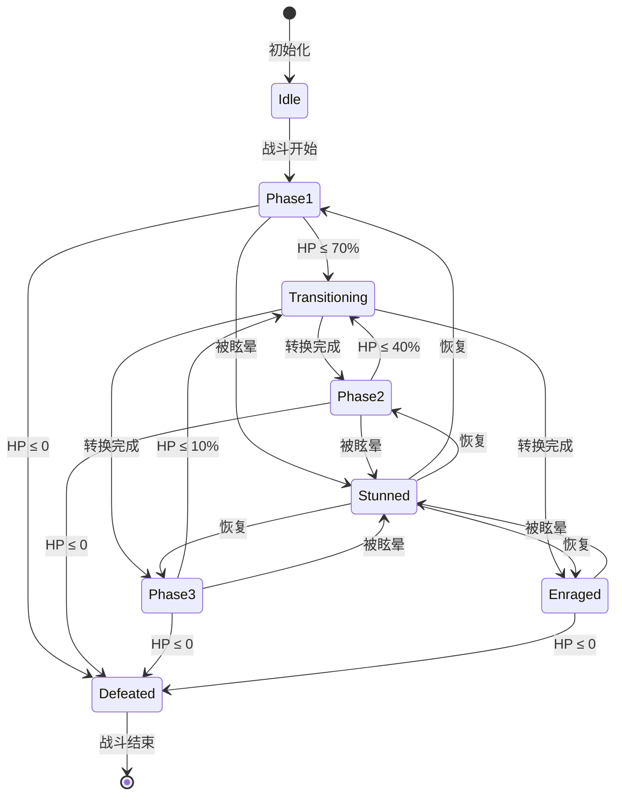
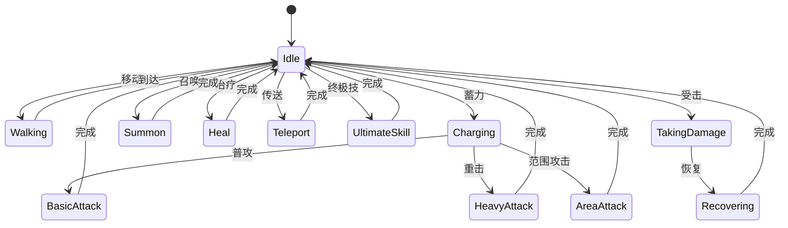
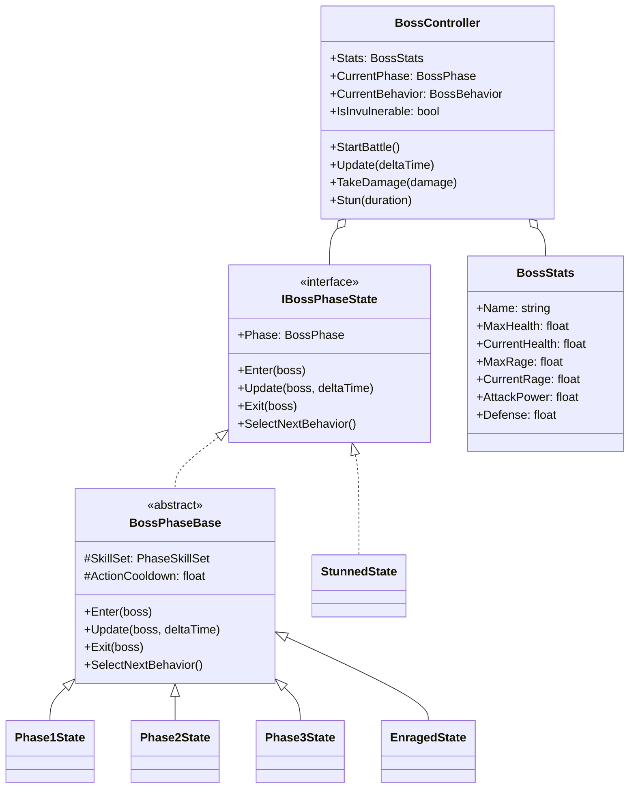

# Boss战状态机 (Boss Fight State Machine)

## 📋 目录
- [概述](#概述)
- [核心特性](#核心特性)
- [状态流转图](#状态流转图)
- [阶段设计](#阶段设计)
- [类图结构](#类图结构)
- [运行示例](#运行示例)

## 概述

Boss战状态机模拟游戏中的Boss战斗系统，包含**多阶段战斗**、**血量触发转换**、**狂暴模式**、**技能系统**等核心机制。

## 核心特性

| 特性 | 描述 |
|------|------|
| **多阶段战斗** | 根据血量自动切换战斗阶段 |
| **阶段转换** | 转换期间Boss无敌+特殊动画 |
| **怒气系统** | 受伤积攒怒气，释放强力技能 |
| **技能权重** | 加权随机选择技能 |
| **狂暴模式** | 低血量触发，攻击大幅增强 |
| **眩晕机制** | 玩家可打断Boss行动 |

## 状态流转图

### 阶段状态机



### 行为状态机



## 阶段设计

### 阶段数值对比

| 阶段 | 血量范围 | 攻击倍率 | 速度倍率 | 特殊机制 |
|------|----------|----------|----------|----------|
| Phase1 | 100%-70% | 1.0x | 1.0x | 基础技能 |
| Phase2 | 70%-40% | 1.3x | 1.2x | 召唤小怪 |
| Phase3 | 40%-10% | 1.6x | 1.4x | 传送突袭、终极技 |
| Enraged | <10% | 2.5x | 2.0x | 狂暴计时、毁灭技能 |

### 技能列表

#### 第一阶段
| 技能 | 伤害 | 冷却 | 权重 |
|------|------|------|------|
| 爪击 | 100 | 1.5s | 5 |
| 尾扫 | 80 | 3s | 2 |
| 龙息 | 150 | 5s | 1 |

#### 第二阶段
| 技能 | 伤害 | 冷却 | 权重 |
|------|------|------|------|
| 连续爪击 | 120 | 1.2s | 4 |
| 震地 | 100 | 2.5s | 3 |
| 烈焰龙息 | 200 | 4s | 2 |
| 召唤龙崽 | - | 10s | 1 |

#### 狂暴阶段
| 技能 | 伤害 | 冷却 | 权重 |
|------|------|------|------|
| 疯狂撕咬 | 200 | 0.5s | 4 |
| 毁灭龙息 | 500 | 2s | 3 |
| 末日陨落 | 800 | 8s | 2 |
| 绝望治愈 | +300 | 20s | 1 |

## 类图结构



## 运行示例

```bash
dotnet run
```

### 预期输出

```
╔════════════════════════════════════════════════════════════════╗
║              Boss战状态机演示 - 龙王之战                       ║
╚════════════════════════════════════════════════════════════════╝

╔════════════════════════════════════════════════════════════╗
║  ⚔️  BOSS战斗开始: 远古龙王                              ⚔️  ║
╚════════════════════════════════════════════════════════════╝

  💬 远古龙王: "你胆敢挑战我？愚蠢的凡人！"
  ⚔️ 进入第一阶段！攻击力 x1

┌──────────────────────────────────────────────────────────────┐
│ 🐉 远古龙王              阶段: Phase1                        │
│ HP: [██████████████████████████████] 10000/10000            │
│ 怒气: [░░░░░░░░░░░░░░░]   0%                                 │
│ 攻击力: 100      防御: 50                                    │
└──────────────────────────────────────────────────────────────┘

--- 回合 1 ---
  🗡️ 玩家攻击！
  💥 远古龙王 受到 350 点伤害！(HP: 9650/10000 = 97%)

  📢 阶段变更: Phase1 → Transitioning
  🔄 阶段转换中...目标: Phase2
  ⚠️ Boss暂时无敌！

  💬 远古龙王: "你比我想象的要强...是时候认真了！"
  ⚔️ 进入第二阶段！攻击力 x1.3
```

## 扩展建议

1. **添加更多Boss类型**: 继承BossController，自定义阶段和技能
2. **技能特效系统**: 添加视觉效果和声音
3. **多玩家支持**: 记录每个玩家的仇恨值
4. **Buff/Debuff系统**: 状态效果叠加
5. **战斗日志**: 详细的伤害统计和回放
